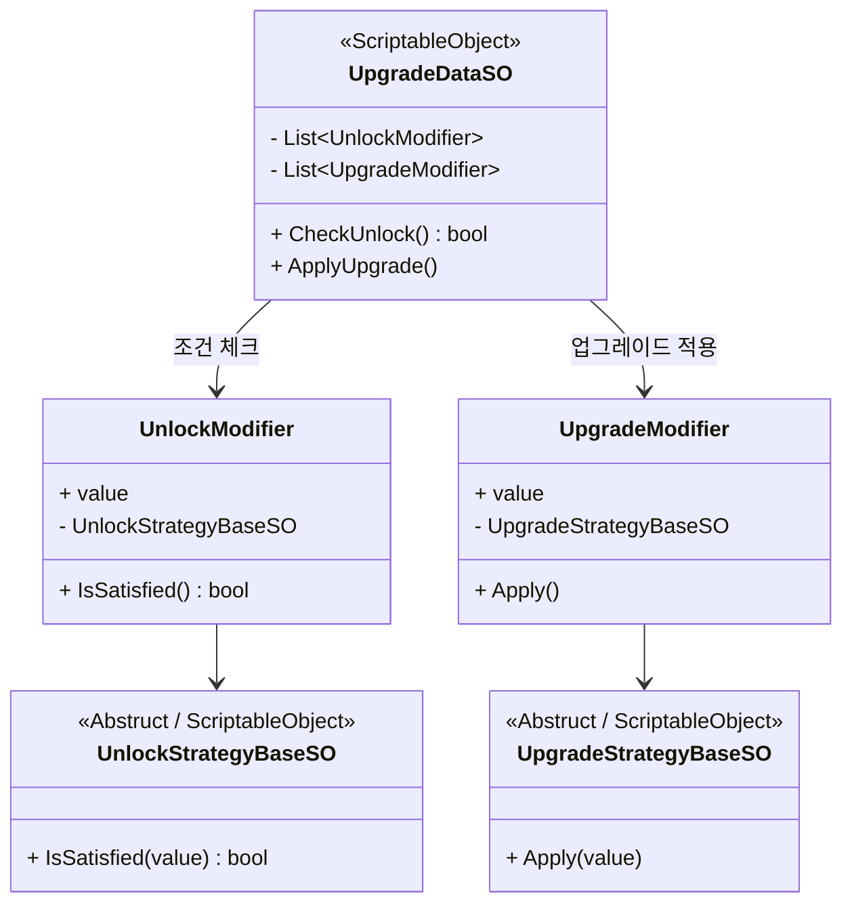
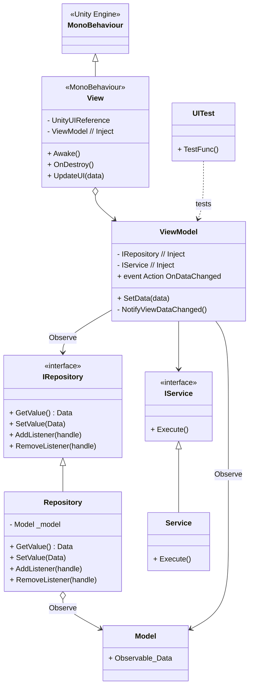

# ProjectHS
**프로젝트 목적** - 이 프로젝트는 단순한 기능 구현을 넘어서, 확장성과 유지보수성을 고려한 구조적 설계에 중점을 두고 개발되었습니다.

# 설계 문서 (link)
- [기획](/_Doc/Planning.md)
- [개발일지](/_Doc/DevelopmentLog.md)
- [시스템 설계](/_Doc/System.md)
---
# 프로젝트 핵심 특징
1. [부분 DOD(Data Oriented Designe) 구조](#1-부분-doddata-oriented-designe-구조)
2. [Upgrade 모듈화](#2-upgrade-모듈화)
3. [MVVM(Model/View/ViewModel) 구조 UI](3-mvvmmodelviewviewmodel-구조-ui)
---
## 1. 부분 DOD(Data Oriented Designe) 구조

ProjectHS는 성능 최적화와 대규모 데이터 처리 효율성을 위해 일부 시스템에 DOD 구조를 적용하였습니다.  
특히, Enemy System은 고반복 계산을 병렬화하기에 적합한 구조로 설계되었습니다.

### 적용 대상: Enemy System

Enemy System은 다수의 Enemy 유닛에 대해 다음의 책임을 가집니다:

- 이동 경로 계산 (Path 따라 이동)
- HP 제어 및 사망 처리
- 애니메이션 갱신
- UI 반영 등

### - DOD 구조 선택 이유
### 동일 연산의 반복성과 병렬 처리 가능성
- 모든 Enemy는 동일한 로직을 반복 수행합니다 (예: 경로 이동)
- SIMD, Job System을 활용한 병렬 연산 구조로 전환이 용이합니다.
- 연산 부하를 멀티 코어에 분산하여 프레임 드랍을 방지할 수 있습니다.

### 대규모 유닛 처리 성능 최적화
- 설계 상 수백~수천 개의 Enemy가 동시에 활동할 수 있습니다.
- OOP 구조는 다음과 같은 성능 저하 요인이 존재합니다:
  - 메모리 위치 분산으로 인한 캐시 미스
  - 가상 함수 호출 오버헤드
- DOD 구조는 연속된 메모리 기반 처리로 CPU 캐시 효율이 높습니다.
  그렇기에 더 많은 Enemy를 부드럽게 처리할 수 있습니다.

### 예상되는 단점 및 고려 사항
| 항목              | 설명                                                                 |
|------------------|----------------------------------------------------------------------|
| 확장성 문제       | 새로운 행동 추가 시 데이터 구조 및 시스템 코드 재작성 필요            |
| 예외 처리 비용     | 특수한 적 행동(보스 등)을 위해 조건문 분기가 증가하면 DOD의 효율 저하 |
| 구조 유연성 제한  | 다양한 행동 패턴이 요구되면 OOP 구조 병행 설계가 필요할 수 있음       |

---
## 2. Upgrade 모듈화
업그레이드 시스템은 **조건(Unlock)**과 **효과(Apply)**를 분리하여 설계된 모듈화 구조입니다.  
전략 패턴과 ScriptableObject 기반으로 구성되어 있으며, **기획 의도에 맞는 다양한 업그레이드 조합이 쉽게 가능**하도록 설계되었습니다.

### 핵심 구조

| 구성 요소 | 설명 |
|----------|------|
| `UnlockStrategyBaseSO` | 업그레이드를 선택할 수 있는 조건 정의 (예: 특정 스테이지 이상, HP 50% 이하 등) |
| `UpgradeStrategyBaseSO` | 조건 만족 시 실제 적용될 업그레이드 효과 정의 (예: 공격력 증가, 체력 회복 등) |

- 각 전략은 추상 클래스를 상속받아 구현됩니다.
- `UpgradeDataSO` 내에서 복수의 Unlock / Apply 전략을 조합할 수 있습니다.

### 설계 목적

- **확장성**: 새로운 조건/효과 추가 시 기존 코드 수정 없이 확장 가능
- **조합성**: 조건과 효과를 자유롭게 조합하여 콘텐츠 다양성 확보
- **비개발자 접근성**: 기획자가 직접 Unity 인스펙터에서 전략을 조합 가능

### 예시 구조 (Class Diagram)

---
## 3. MVVM(Model/View/ViewModel) 구조 UI
ProjectHS는 UI의 복잡도와 유지보수 가능성을 고려하여 **MVVM 아키텍처를 적용한 UI 구조**를 채택하였습니다.  
복잡하거나 기능 확장 가능성이 높은 UI는 MVVM 구조로, 단순하고 고정적인 UI는 MonoBehaviour 단일 구조로 설계합니다.

### 설계 목적

| 구조 유형 | 적용 대상 | 특징 |
|-----------|-----------|------|
| **MVVM 구조** | 복잡한 UI / 상태 기반 화면 | 테스트 용이성, 의존성 분리, 재사용성 확보 |
| **MonoBehaviour 단일 구조** | 단순한 UI 화면 | 빠른 개발 속도, 구조 단순화 |

- **MVVM 구조**는 UI 상태와 비즈니스 로직을 분리하여 유지보수성을 높입니다.
- **MonoBehaviour UI**는 빠르게 완성할 수 있으며, 고정된 UI에 적합합니다.

### MVVM 계층 역할

| 계층       | 역할 요약     | 세부 설명 |
|------------|----------------|------------|
| **Model**      | 상태 보관 및 참조 | - UI 상태 데이터를 저장 - 외부 데이터는 Repository를 통해 접근 - 인게임 전용 데이터는 DI 주입 |
| **ViewModel**  | 중재자 역할 | - View와 Model 간 데이터 연결 - 이벤트 기반으로 View 갱신 - 복잡한 로직은 Service에 위임 |
| **View**       | 렌더링 및 입력 처리 | - Unity UI 요소를 담당 - ViewModel의 이벤트를 구독하여 UI 업데이트 - UI 요소 초기화 처리 담당 |

### 의존성 주입 흐름

- `Repository`는 외부 데이터 접근을 전담하며 `ViewModel`이 직접 접근하지 않도록 분리합니다.
- `ViewModel`은 데이터를 가공하고 필요한 로직을 `Service`에 위임합니다.
- 모든 의존성은 **Zenject**를 통해 주입하며, **테스트 환경에서도 대체 가능**하도록 설계됩니다.

### UI 클래스 다이어그램

---
# 플레이 영상

---
# 향후 프로젝트 개선 방향
프로젝트는 구조적 완성도와 시스템 설계에 초점을 맞추어 개발되었으나, 향후 콘텐츠 측면에서 다음 두 가지 보강이 필요합니다.

## 1. 디테일 추가

현재 게임의 연출 및 시각적 표현은 기능 중심으로 구성되어 있으며, 몰입감을 높이기 위한 **감성적 요소**가 부족한 상태입니다.  
향후에는 다음과 같은 디테일 요소 추가를 통해 완성도를 높일 계획입니다:

- 타격감 및 액션성을 강화하는 **타워 / 적 이펙트** 추가
- 업그레이드 시 **시각적 피드백 효과** 삽입
- UI 애니메이션 및 전환 효과 정교화
- 보스 등장 / 사망 등 **상황별 연출 처리**
- 사운드 추가

## 2. 볼륨 추가

게임 구조는 유연하고 확장 가능하게 설계되어 있지만, 현재 콘텐츠 양(볼륨)은 제한적입니다.  
다음과 같은 콘텐츠 확장을 통해 **게임의 재미**를 강화할 수 있습니다:

- **업그레이드 종류** 추가: 다양한 전략적 선택을 유도
- **타워 유형** 확장: 공격 방식과 속성에 따른 상호작용 추가
- **적 유닛 다양화**: 속도, 체력, 특수 능력을 갖춘 적 유형 도입
- **스테이지 구조 변화**: 맵 패턴, 웨이브 분기 등 복합적 구성 도입

---
# 기술 스택
## library pakege
  - UniTask
  - Addressable
  - DOTween
  - Google Play Games SDK
  - Firebase SDK
  - Unity Test Runner
## Tool
  - Github
## Server
  - Firebase

# Open Sources, Pakage
- [UniTask](https://github.com/Cysharp/UniTask) - 유니티 쓰레드 관리
- [DOTween](https://assetstore.unity.com/packages/tools/animation/dotween-hotween-v2-27676) - 연출
- [Extenject](https://github.com/modesttree/Zenject?tab=readme-ov-file#installation-) - 의존성 주입
- [NSubstitute](https://github.com/Thundernerd/Unity3D-NSubstitute) - 테스트 용으로 사용
