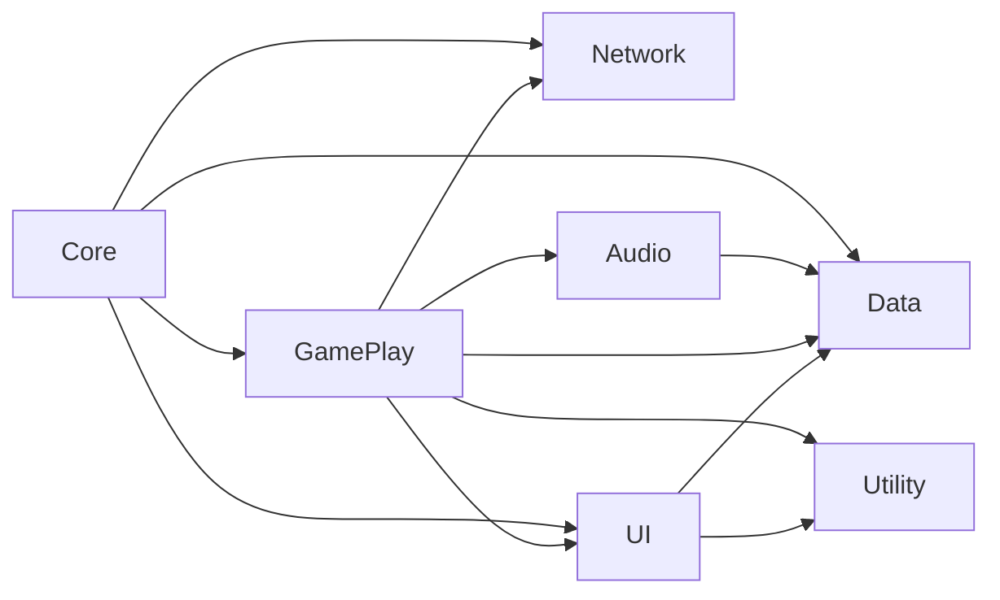
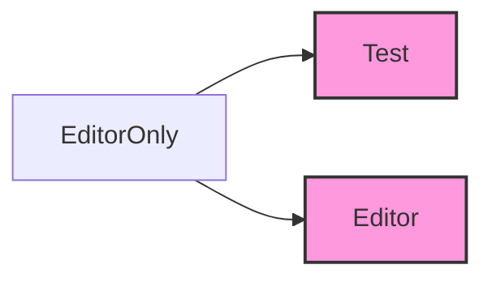
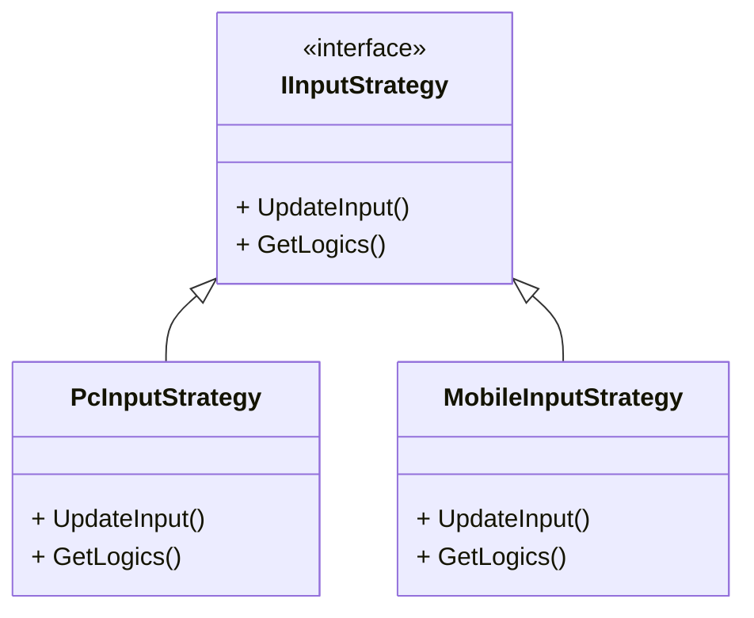

## 개발 일지
#### 개발 과정
- [2025.04.19 / 시스템 구조 설계](#전체-시스템-구조-설계)
- [2025.04.19 / UI 설계 MVVM](#ui-설계)
- [2025.04.19 / DI 선택](#didependency-injection)
- [2025.04.24 / 확장성 고려 비지니스 로직](#확장성-고려)
---
#### 2025.04.19
### 전체 시스템 구조 설계
초기 기획 후 최우선 과제는 '전체 시스템을 어떤 구조로 구성할 것인가'를 결정하는 것이었습니다.</br> 
먼저 코드의 역할 기준으로 네임스페이스를 나누고 각 네임스페이스가 서로 어떻게 의존할지(의존성 방향)을 설정했습니다.



- **Core:** 게임의 초기화 담당
- **Data:** 사용되는 데이터, Addressable 로드
- **GamePlay:** 게임 핵심 로직
- **Network:** Firebase연동
- **UI:** User Interface
- **Audio:** 사운드 관리
- **Utility:** Helper, Utills, DesignPattern 등
- ${\textsf{\color{magenta}Editor}}$
  - **Test:** Test 코드 묶음
  - **Editor:** Editor 환경에서 사용 하는 코드

이렇게 정의된 기준과 구조를 바탕으로 코드 작성을 진행할 계획을 했습니다.

---
#### 2025.04.19
### UI 설계
UI(User Interface)를 MVVM(Model-View-ViewModel) 구조로 선택한 이유는 다음과 같습니다.
- **명확한 역할 분리**
    - **View:** 사용자에게 보여지는 UI 요소(버튼, 텍스트, 이미지 등)와 최소한의 View 관련 로직(애니메이션 등)만 담당합니다.
    - **ViewModel:** View를 위한 데이터, View로부터의 사용자 입력(커맨드)을 처리합니다. Model로부터 데이터를 가져와 View가 사용하기 쉬운 형태로 가공합니다.
    - **Model:** 애플리케이션의 데이터와 비즈니스 로직을 담당하며, 독립적 구조를 가지고 있습니다.
- **테스트 용이성:** ViewModel이 View에 직접 의존하지 않아 결합도가 낮습니다. 덕분에 UI 요소 없이도 ViewModel의 로직을 검증하는 테스트 코드를 작성하기가 훨씬 수월해서 이 패턴을 선택했습니다.

---
#### 2025.04.19
### DI(Dependency Injection)
DI(Dependency Injection) 도구로는 [Zenject](https://github.com/modesttree/Zenject)를 사용했습니다. </br>
DI를 사용한 핵심 이유는 다음과 같습니다.
- 중앙화된 초기화 관리: Singleton class 객체들의 생성 및 초기화 시점을 일관되게 관리하여, 모든 씬에서 누락 없이 안정적으로 사용할 수 있도록 하고 싶었습니다.
- 안정적인 의존성 관리: 특히 데이터 관련 객체들의 생성, 초기화, 그리고 필요한 곳에서의 참조 과정을 DI를 통해 명확하고 안정적으로 처리함으로써 의존성 누락, 잘못된 참조 같은 잠재적인 실수를 줄이고자 했습니다.
  

주로 DI로 관리한 항목은 다음과 같습니다.
- **Manager Class:** Singleton 항목을 관리. (예: DataManager, GameManager ...)
- **Repo/Data Class:** Repository 패턴, Data를 관리.
- **Scene Data:** Scene에 핵심적으로 사용되는 Main Canvas, UI 등을 관리

---
#### 2025.04.24
### 확장성 고려
나중에 변경, 확장될 부분 중 비지니스 로직 부분은 Strategy 패턴으로 분리했습니다. </br>
**ex)  인풋을 체크하는 로직**

Mobile 환경과 PC 환경에서 다른 Input 처리를 하기 위해 분리했습니다.
```C#
// 사용 예시
#if UNITY_EDITOR
    IInputStrategy inputStrategy = new PcInputStrategy();
#elif UNITY_ANDROID || UNITY_IOS
    IInputStrategy inputStrategy = new MobileInputStrategy();
#else // Mobile 환경이 아니면
    IInputStrategy inputStrategy = new PcInputStrategy();
#endif
    _inputSystem.SetInputStrategy(inputStrategy); // set 설정
```

---
