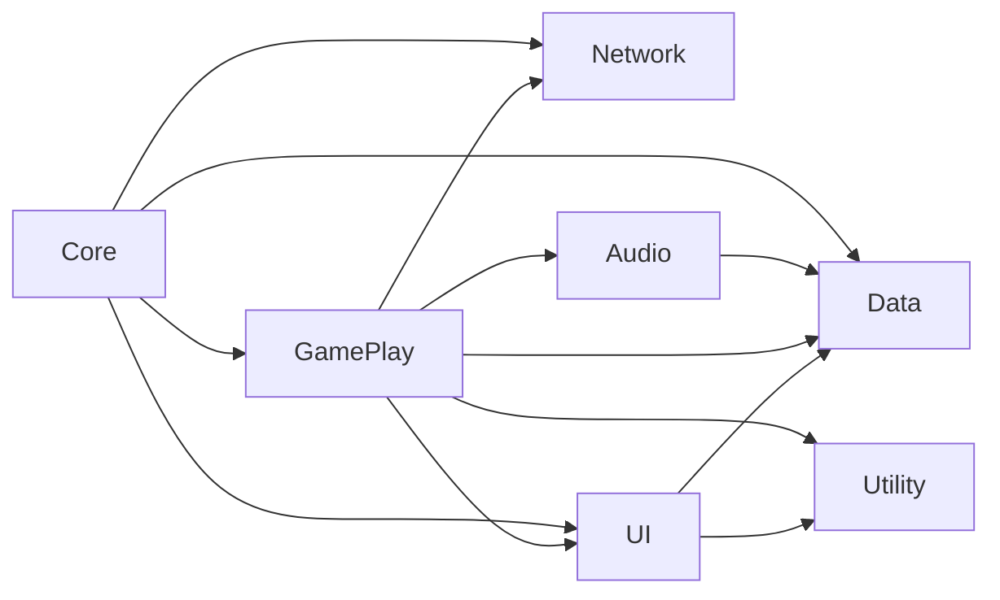
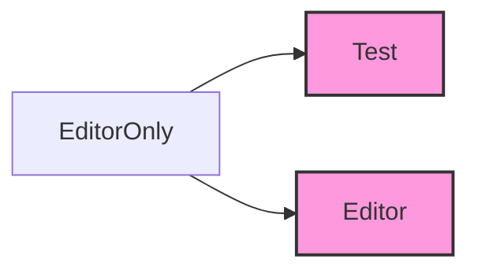

## 개발 일지
#### 개발 과정
- [시스템 구조 설계](#전체-시스템-구조-설계)

### 전체 시스템 구조 설계
초기 기획 후 최우선 과제는 '전체 시스템을 어떤 구조로 구성할 것인가'를 결정하는 것이었습니다.  이를 해결하기 위해, 먼저 코드의 역할 기준으로 네임스페이스를 나누고 각 네임스페이스가 서로 어떻게 의존할지(의존성 방향)를 명확히 설정했습니다.

- **Core:** 게임의 초기화 담당
- **Data:** 사용되는 데이터, Addressable 로드
- **GamePlay:** 게임 핵심 로직
- **Network:** Firebase연동
- **UI:** User Interface
- **Audio:** 사운드 관리
- **Utility:** Helper, Utills, DesignPattern 등
- ${\textsf{\color{magenta}Editor}}$
  - **Test:** Test 코드 묶음
  - **Editor:** Editor 환경에서 사용 하는 코드

이렇게 정의된 기준과 구조를 바탕으로 코드 작성을 진행할 계획을 했습니다.
