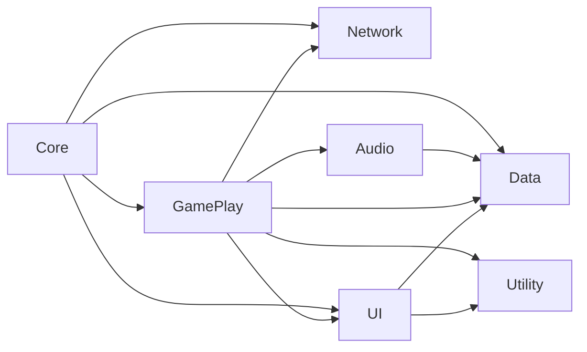
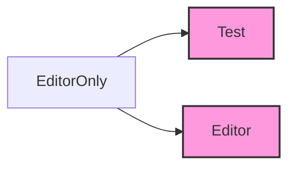
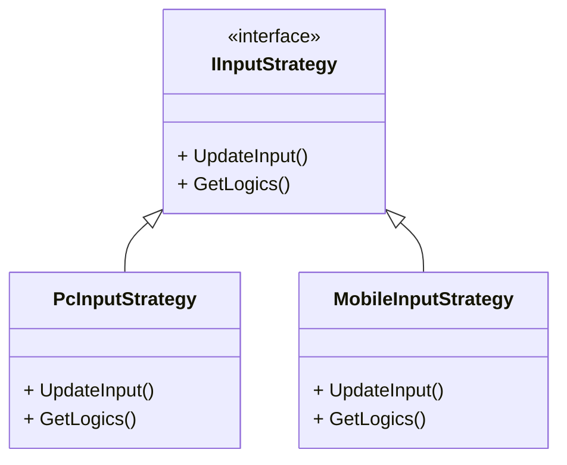
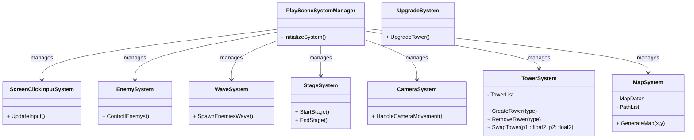
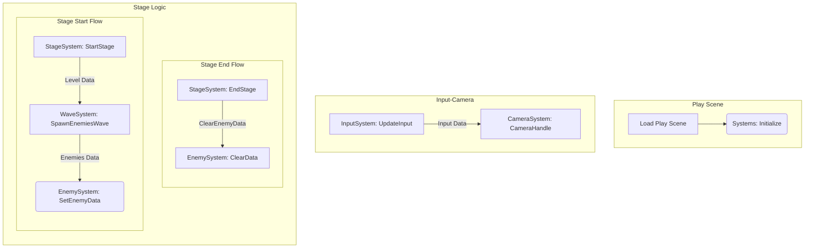
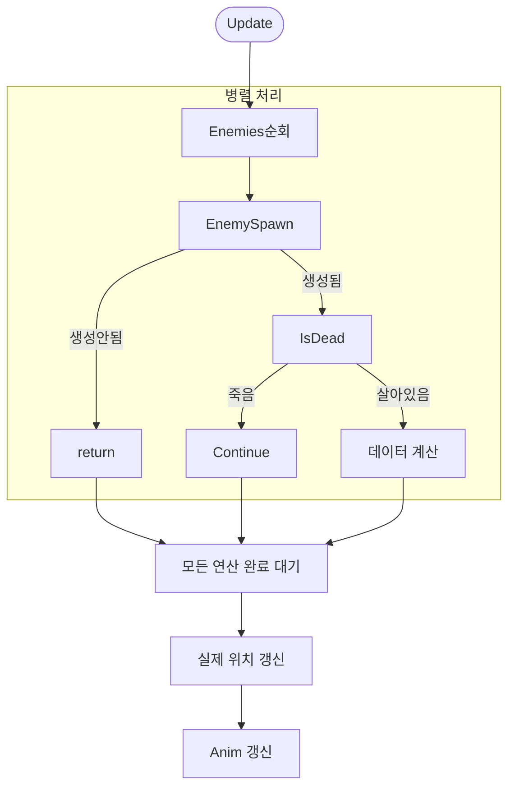
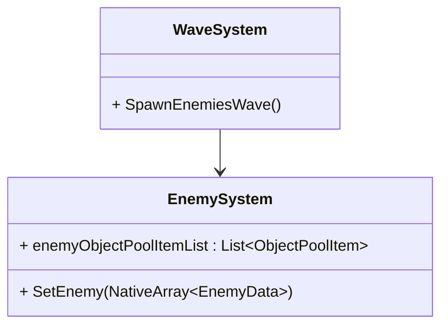
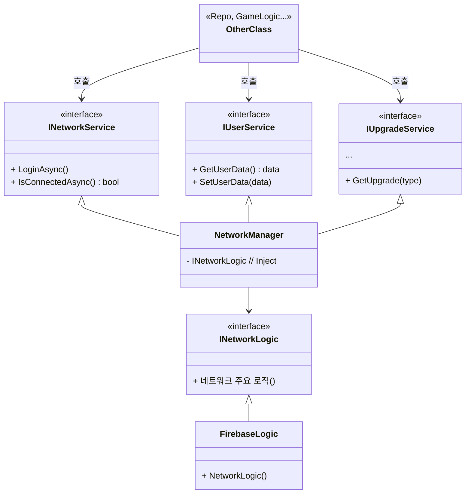
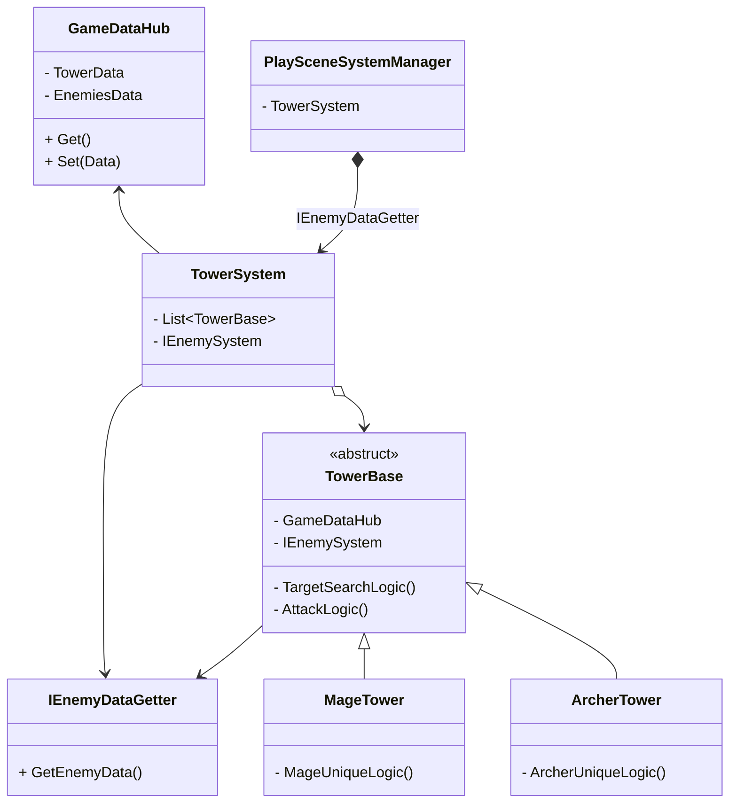
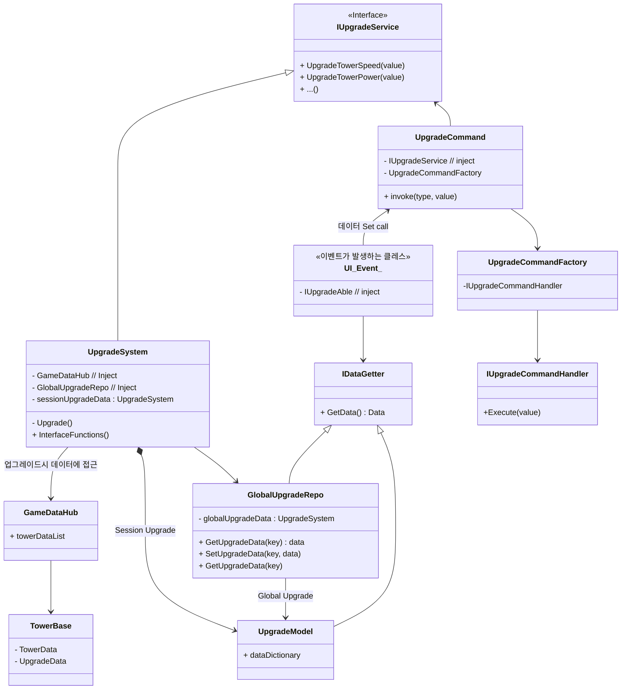

## 개발 일지
#### 개발 과정
#### 25.04
- [2025.04.19 / 시스템 구조 설계](#전체-시스템-구조-설계)
- [2025.04.19 / UI 설계 MVVM](#ui-설계)
- [2025.04.19 / DI 선택](#didependency-injection)
- [2025.04.24 / 확장성 고려 비지니스 로직](#확장성-고려)
- [2025.04.28 / Core System 설계](#game-play-system-설계)
#### 25.05
- [2025.05.06 / Enemy System 설계](#enemy-system-설계dod구조)
- [2025.05.07 / ~~Wave System - Enemy System 결합 이유~~ -> Data Hub를 통해 참조하는 방식으로 변경](#wave-system---enemy-system-결합-설계-배경)
- [2025.05.12 / Network 설계](#network-설계)
- [2025.05.15 / Tower System 설계](#tower-system-설계)
- [2025.05.15 / GameDataHub 도입 배경 및 설계](#gamedatahub-도입-배경-및-설계)
- [2025.05.19 / GameObjectPoolManager 도입 배경 및 설계](#gameobjectpoolmanager-도입-배경-및-설계)
- [2025.05.26 / Upgrade System 설계](#upgrade-system-설계)
---
#### 2025.04.19
### 전체 시스템 구조 설계
초기 기획 후 최우선 과제는 '전체 시스템을 어떤 구조로 구성할 것인가'를 결정하는 것이었습니다.</br> 
먼저 코드의 역할 기준으로 네임스페이스를 나누고 각 네임스페이스가 서로 어떻게 의존할지(의존성 방향)을 설정했습니다.



- **Core:** 게임의 초기화 담당
- **Data:** 사용되는 데이터, Addressable 로드
- **GamePlay:** 게임 핵심 로직
- **Network:** Firebase연동
- **UI:** User Interface
- **Audio:** 사운드 관리
- **Utility:** Helper, Utills, DesignPattern 등
- ${\textsf{\color{magenta}Editor}}$
  - **Test:** Test 코드 묶음
  - **Editor:** Editor 환경에서 사용 하는 코드

이렇게 정의된 기준과 구조를 바탕으로 코드 작성을 진행할 계획을 했습니다.

---
#### 2025.04.19
### UI 설계
UI(User Interface)를 MVVM(Model-View-ViewModel) 구조로 선택한 이유는 다음과 같습니다.
- **명확한 역할 분리**
    - **`View`:** 사용자에게 보여지는 UI 요소(버튼, 텍스트, 이미지 등)와 최소한의 `View` 관련 로직(애니메이션 등)만 담당합니다.
    - **`ViewModel`:** `View`를 위한 데이터, `View`로부터의 사용자 입력(커맨드)을 처리합니다. `Model`로부터 데이터를 가져와 `View`가 사용하기 쉬운 형태로 가공합니다.
    - **`Model`:** 애플리케이션의 데이터와 비즈니스 로직을 담당하며, 독립적 구조를 가지고 있습니다.
- **테스트 용이성:** `ViewModel`이 `View`에 직접 의존하지 않아 결합도가 낮습니다. 덕분에 UI 요소 없이도 `ViewModel`의 로직을 검증하는 테스트 코드를 작성하기가 훨씬 수월해서 이 패턴을 선택했습니다.

---
#### 2025.04.19
### DI(Dependency Injection)
DI(Dependency Injection) 도구로는 [Zenject](https://github.com/modesttree/Zenject)를 사용했습니다. </br>
DI를 사용한 핵심 이유는 다음과 같습니다.
- 중앙화된 초기화 관리: Singleton class 객체들의 생성 및 초기화 시점을 일관되게 관리하여, 모든 씬에서 누락 없이 안정적으로 사용할 수 있도록 하고 싶었습니다.
- 안정적인 의존성 관리: 특히 데이터 관련 객체들의 생성, 초기화, 그리고 필요한 곳에서의 참조 과정을 DI를 통해 명확하고 안정적으로 처리함으로써 의존성 누락, 잘못된 참조 같은 잠재적인 실수를 줄이고자 했습니다.
  

주로 DI로 관리한 항목은 다음과 같습니다.
- **Manager Class:** Singleton 항목을 관리. (예: `DataManager`, `GameManager` ...)
- **Repo/Data Class:** Repository 패턴, Data를 관리.
- **Scene Data:** Scene에 핵심적으로 사용되는 Main Canvas, UI 등을 관리

---
#### 2025.04.24
### 확장성 고려

비즈니스 로직 중 향후 **플랫폼 환경에 따라 변경되거나 확장될 수 있는 부분**은 `Strategy 패턴`을 사용해 분리하였습니다.

대표적인 예로, **입력(Input) 처리 로직**은 PC 환경과 Mobile 환경에서 요구 사항이 다르므로,
이를 런타임 조건에 따라 유연하게 교체할 수 있도록 `IInputStrategy` 인터페이스 기반 구조로 설계하였습니다.

- **설계 이점**
    1. **OCP(개방 폐쇄):** 새로운 입력 방식이 추가되더라도 기존 코드를 수정하지 않고 Strategy만 추가하면 됨
    2. **SRP(단일 책임):** InputSystem은 입력 처리 전략을 사용하는 역할만 담당
    3. **테스트 및 플랫폼 대응 용이:** 각 플랫폼 전략을 분리하여 독립적으로 테스트 가능

**ex)  인풋을 체크하는 로직**

Mobile 환경과 PC 환경에서 다른 Input 처리를 하기 위해 분리했습니다.
```C#
// 사용 예시
#if UNITY_EDITOR
    IInputStrategy inputStrategy = new PcInputStrategy();
#elif UNITY_ANDROID || UNITY_IOS
    IInputStrategy inputStrategy = new MobileInputStrategy();
#else // Mobile 환경이 아니면
    IInputStrategy inputStrategy = new PcInputStrategy();
#endif
    _inputSystem.SetInputStrategy(inputStrategy); // set 설정
```

---
#### 2025.04.28
### Game Play System 설계
Game Play에 필요한 핵심 System들을 설계 하였습니다.

PlaySceneSystemManager에서 GamePlay에 필요한 System 들을 설계 하였습니다.</br>
각 System의 역할을 다음과 같습니다.</br>
- **MapSystem:** 맵 데이터 생성, 맵 오브젝트 생성
- **ScreenClickInputSystem:** Input 관리
- **EnemySystem:** Enemy 행동 제어
- **StageSystem:** 스테이지 시작과 종료
- **WaveSystem:** 스테이지 Level에 맞는 Wave(enemy) 생성
- **CameraSystem:** 카메라 제어
- **TowerSystem:** 타워 생성, 제거, 위치 변경
- **UpgradeSystem:** 업그레이드

우선 Stage, Input-Camera System의 Flowchart를 구성했습니다.


---
#### 2025.05.06
### Enemy System 설계(DOD구조)
`Enemy System`은 Enemies의 행동을 컨트롤 하는 클레스 입니다.</br> 
`Enemy System`은 다음과 같은 이유를 고려하여 DOD(Data Oriented Design) 구조를 선택하였습니다.
- **DOD 구조 선택 이유**
1. **동일 연산의 높은 반복성 및 병렬 처리 잠재력**
    - `Enemy System`의 핵심 기능 중 하나는 지정된 Path를 따라 Enemy들을 이동시키는 것입니다.
    - 이 Path 로직은 각 Enemy에게 거의 동일하게 적용됩니다.
    - 이처럼 동일한 연산을 다수의 데이터에 반복 적용하는 것은 DOD의 강점과 잘 부합합니다.
    - 동일 연산의 반복은 SIMD(Single Instruction Multiple Data) 명령어 활용이나 멀티스레딩 기반의 병렬 처리에 매우 유리합니다.
    - `Job System` 등을 활용하여 여러 Enemy의 이동 연산을 동시에 처리함으로써 대규모 Enemy 처리에 필요한 연산 시간을 크게 단축할 수 있을 것으로 기대하였습니다.
2. **대규모 Enemy 처리 효율성**
    - 게임 기획 상 수백, 수천 개의 Enemy가 동시에 화면에 등장하고 활동해야 할 수 있습니다.
    - OOP 방식에서는 각 Enemy가 객체로 존재하며, 각 객체의 메모리 위치 캐시 미스, 가상 함수 호출 등의 오버헤드가 많이 발생될것으로 예상이 되었습니다.
    - DOD는 데이터를 중심으로 시스템을 구성하므로, 대량의 데이터를 효율적으로 순회하고 처리하는 데 최적화되어 있습니다.
    - 이를 통해 동일 하드웨어 사양에서도 더 많은 수의 Enemy를 부드럽게 처리할 수 있을 것으로 예상합니다.
- **예상되는 문제점**
1. **확장성**
   - 새로운 행동 추가 시, 새로운 Data 설계 및 System 수정, 추가가 필요합니다.
   - 특정 Enemy 유형만을 위한 예외적인 로직을 처리하기 위해 System 내부에 조건 분기가 많아지면, DOD의 장점인 단순 반복 처리의 이점이 줄어들것으로 예상이 되었습니다.

#### Enemy의 행동
- Data 제어(Move, HP, Die)
- UI 제어
- Animation


---
#### 2025.05.07
### ~~Wave System - Enemy System 결합 설계 배경~~
-> [**Data Hub를 거쳐 참조하는 방식으로 변경**](#gamedatahub-도입-배경-및-설계)
1. **시스템 기본 원칙 및 개요** </br>
일반적으로 각 `System`은 독립성을 유지하며 `PlayScene.cs`를 통해 연결, 결합 하는것을 지향합니다. </br>
`Wave System`과 `Enemy System` 간의 데이터 전달 방식의 제약으로 인해 예외적인 설계를 적용하게 되었습니다. </br>
각 시스템의 주요 역할은 다음과 같습니다. </br>

- **Wave System**
    - 웨이브 단위로 적 생성을 담당합니다.
    - 생성된 적의 데이터 `EnemyData`를 관리합니다. 
    - `Object Pool`에서 실제 게임 오브젝트 `GameObject`를 가져와 데이터 `EnemyData`와 매칭 하여 `Enemy System`에 전달 하는 역할을 합니다.
  
- **Enemy System**
    - 개별 적들의 행동 상태를 제어합니다.
    - Wave System으로부터 전달받은 적 데이터를 기반으로 실제 게임 월드에서의 적을 관리합니다.
   
2. **결합 결정의 핵심 이유: `NativeArray<EnemyData>` 전달의 어려움**
    - 결합 배경은 `Wave System`에서 생성된 대량의 적 데이터(`NativeArray<EnemyData>`)를 `Enemy System`으로 전달하는 것이었습니다. 
    - 이벤트 시스템의 한계: 표준적인 이벤트 방식(C# event)은 `NativeArray`와 같은 네이티브 컨테이너를 직접적이고 효율적으로 전달하는 데 적합하지 않습니다. 데이터를 복사하거나 래핑하는 과정에서 성능 저하 또는 관리의 복잡성이 발생할 수 있습니다.
    - 이러한 이유로, `Wave System`이 `NativeArray<EnemyData>`를 생성한 후, 이를 직접 `Enemy System`에 전달하여 참조를 공유하는 결합 방식을 채택하게 되었습니다.
3. **결합 방식 및 데이터 흐름**
    - `Wave System`은 새로운 웨이브가 시작될 때 적들의 초기 데이터를 담은 `NativeArray<EnemyData>`를 생성합니다.
    - 생성된 `NativeArray<EnemyData>`는 `Enemy System`의 메소드를 통해 전달됩니다.
    - `Enemy System`은 이 `NativeArray`에 대한 참조를 받아, `Job System` 등을 활용하여 적들의 움직임, 상태 업데이트 등 실제 컨트롤 로직을 수행합니다.
    - `Wave System`은 적 게임 오브젝트 풀링 및 초기 매칭에 집중하고, `Enemy System`은 전달받은 데이터를 기반으로 실제 게임 로직 처리에 집중함으로써 역할 분담은 유지합니다.


---
#### 2025.05.12
### Network 설계
네트워크 모듈 설계에서는 인터페이스 기반의 계층화된 아키텍처를 적용하여 유연하고 테스트 가능한 구조를 구성하였습니다.</br> 
(현재 프로젝트는 Network를 Firebase 기반으로 사용하여 구현체 부분은 Firebase 부분만 구현하였습니다.)
1. **상위 로직 (``OtherClass``)** </br>
`INetworkService`, `IUserService`, `IUpgradeService` 등 다양한 서비스 인터페이스를 통해 네트워크 기능을 호출합니다. 상위 계층은 구체적인 구현체에 의존하지 않고 추상화된 접근을 하도록 구성하였습니다.

2. **중간 관리자 (``NetworkManager``)** </br>
`NetworkManager`는 각 서비스 인터페이스의 구현체 역할을 하며, 내부적으로는 `INetworkLogic` 인터페이스를 주입받아 외부 네트워크 로직과 연결됩니다. 이를 통해 서비스 로직과 실제 네트워크 처리 로직 간의 명확한 분리를 구현하였습니다.

3. **구현체 (``FirebaseLogic`` 등)** </br>
실제 데이터 처리 로직은 `INetworkLogic`을 상속한 구현체(FirebaseLogic, DB, Test 등)에서 담당하며, 추후 변경될 수 있는 로직을 모듈화하여 구현하였습니다.



---
#### 2025.05.15
### Tower System 설계
1. **Tower System**
    - 타워의 위치, 생성, 판매를 담당합니다.
    - 모든 타워를 중앙에서 집중적으로 관리(생성, 배치, 판매)를 하려고 설계를 하였습니다.
2. **TowerBase**
    - 타워의 행동을 정의하는 클레스
    - 새로운 종류의 타워를 추가할 때 `TowerBase`를 상속받아 새로운 클래스를 만들기만 하면 되는 구조로 설계 하였습니다.
- **IEnemyDataGetter**
    - `Tower`의 공격 로직을 정의할때 `Enemy`의 데이터(위치, hp 등)이 필요합니다.
    - 적 시스템이 변경되더라도 타워 시스템에 미치는 영향을 최소화하기 위해 인터페이스로 분리하였습니다.  



---
#### 2025.05.15
### GameDataHub 도입 배경 및 설계
1. **문제 배경: 시스템 간 데이터 공유의 필요성**
현재 프로젝트는 **PlaySceneSystemManager를 통해 각 시스템을 초기화하고 연결**하는 구조를 따르며,  
각 시스템은 서로의 존재를 직접 참조하지 않고 독립적으로 동작하도록 설계되었습니다.

하지만 다음과 같은 데이터 공유 요구가 발생했습니다:
- `TowerSystem` 혹은 개별 타워 객체 `TowerBase`는 적을 타겟팅하기 위해 **`EnemyData`에 접근**해야 합니다.
- 반면, **`EnemyData`는 `EnemySystem`에서 관리되고 생성**됩니다.
- 시스템 간 직접 참조를 피하면서도 성능을 저해하지 않고 `EnemyData`를 공유해야 하는 상황이 발생했습니다.

2. **기존 접근 방식의 한계**
- 직접 참조
    - `TowerSystem`이 `EnemySystem`을 직접 참조하는 방식은 **결합도가 증가**하며, 향후 유지보수 및 확장 시 문제를 유발합니다.

- 이벤트 전달 방식
    - `EnemyData`는 `NativeArray<T>` 기반으로 관리되며,  
  일반 C# 이벤트나 메시지 시스템을 통해 전달하기에는 **Burst, JobSystem과의 호환성**, **복사 비용**, **GC 부하** 등의 문제가 발생합니다.
  
3. **해결 방식: `GameDataHub` 도입**</br>
이 문제를 해결하기 위해 **시스템 간 공유 데이터를 관리하는 전용 클래스인 `GameDataHub`를 도입**하였습니다.

4. **설계 원칙**
- `GameDataHub`는 실제 데이터를 **생성하거나 소유하지 않습니다.**
- 각 시스템에서 생성한 데이터를 참조 형태로 등록하고,
  다른 시스템은 이 참조를 통해 데이터를 읽을 수 있도록 합니다.
- 각 시스템은 Init 단계에서 필요한 데이터를 `GameDataHub`를 통해 받아, 내부에서는 **직접 참조로 접근**합니다.
- `Dispose` 타이밍은 내부에서 (Set, 소멸) 타이밍에 관리합니다.

ex)
```c#
// GameDataHub.cs
public class GameDataHub : IEnemyDataProvider
{
    private NativeArray<EnemyData> _enemyData;
    ~GameDataHub() {
        if(_enemyData.IsCreated) _enemyData.Dispose();    
    }
    public void SetEnemyData(NativeArray<EnemyData> data) {
        if(_enemyData.IsCreated) _enemyData.Dispose();
        _enemyData = data;
    }
    public NativeArray<EnemyData> GetEnemyData() => _enemyData;
}
```
---
#### 2025.05.19
### GameObjectPoolManager 도입 배경 및 설계
1. **문제 배경: `Object Pool` 통합 관리의 필요성** </br>
현재 프로젝트에서는 Arrow, Enemy 등의 게임 오브젝트를 `Object Pool`을 통해 재사용하고 있으며, 이들 각각은 고유의 Key를 통해 Addressables에서 Prefab을 로드하여 생성됩니다. 이러한 리소스들은 게임 진행 중 지속적으로 생성되고 소멸되므로, 다음과 같은 문제가 발생했습니다.
- 각 풀을 개별적으로 관리하게 되면 중복 코드 증가, 관리 주체 분산, 상태 추적 어려움 등의 문제가 생김
- 사용이 끝난 오브젝트나 필요 없는 풀을 적시에 해제하지 않으면 불필요한 메모리 점유가 계속됨

2. **해결 방안: `GameObjectPoolManager` 설계 목표** </br>
이러한 문제를 해결하고자 `GameObjectPoolManager`를 도입하였으며, 주요 설계 목표는 다음과 같습니다.
- **중앙 집중형 관리:** 모든` Object Pool`에 대한 생성, 접근, 반환, 해제를 하나의 Manager에서 일괄적으로 처리하여 일관성과 유지보수성을 확보
- **Key 기반 접근:** 각 풀은 고유 Key를 통해 식별되며, Addressable Key를 그대로 재활용함으로써 리소스 로딩 및 매칭 로직을 간소화
- **메모리 최적화:** 더 이상 사용되지 않는 `Object Pool`은 명시적 또는 조건 기반으로 제거하여 런타임 메모리 사용량을 최소화


---
#### 2025.05.26
### Upgrade System 설계
1. **설계 내용**
`Upgrade System`의 경우 계정 전체에 적용이 되는 `Global Upgrade`와 세션 단위로 초기화, 관리 되는 `SessionUpgrade`가 존재합니다.</br>
`Global Upgrade`의 경우 `Repository` 패턴을 이용해 데이터를 관리합니다.</br>
`SessionUpgrade`의 경우 세션 단위로 초기화, 관리 되어 PlayScene에서 생성하여 관리합니다.</br>

2. **설계 의도**
- **`Global Upgrade`의 경우` Repository`를 사용한 이유는 다음과 같습니다.** </br>
    - `Global Upgrade`의 경우 Firebase에 데이터를 저장해서 Repository 패턴을 통해 저장 책임을 분리하였습니다. </br>
    - 추후 Firebase가 아닌(다른 DB, 로컬) 등 데이터 저장이 변경되어도 기존 코드의 변경이 아닌 확장을 위하여 분리하였습니다.</br>
    - 게임 진행중(Session) 중에 변동이 될 내용이 없기 때문에 사용하였습니다. </br> 
- **`Command` 도입 이유** </br>
    - 기능 캡슐화 및 확장성 확보, 로깅, 실행 취소, 테스트 등의 기능을 `Command` 객체 단위로 추후 확장 할 수 있습니다. </br>  
- **`Factory` 도입 이유** </br> 
    - OCP(개방 폐쇄) 준수 </br> 
    - `Factory`를 도입하 새로운 핸들러를 등록만 하면 되고, 기존 로직은 수정 없이 확장 가능합니다. </br> 




