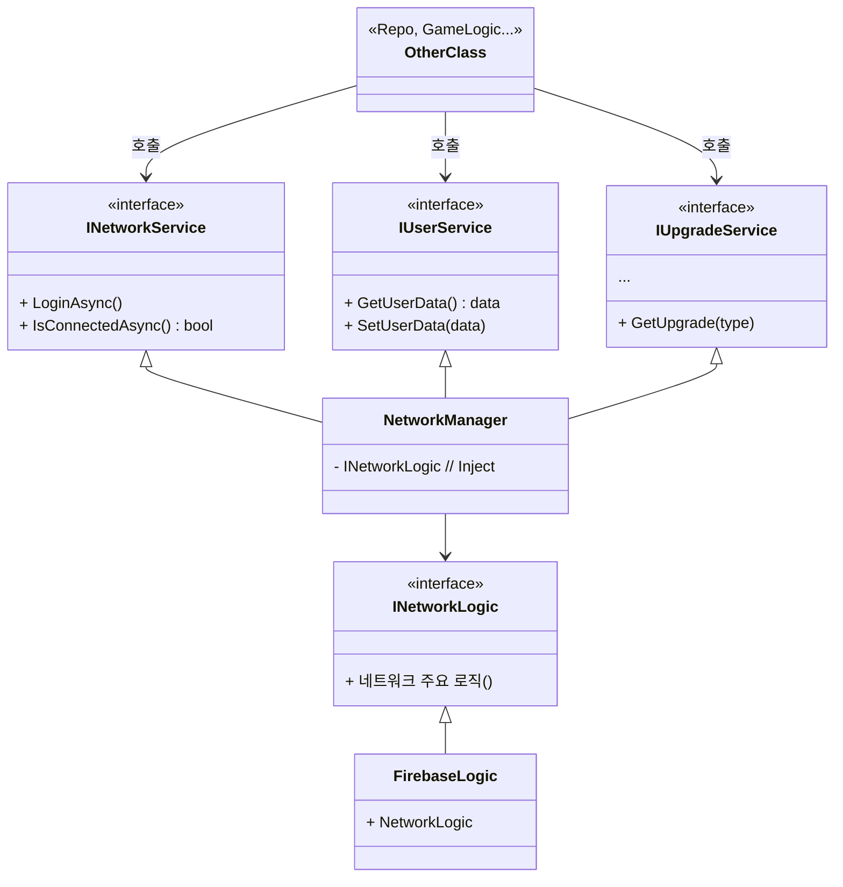

## 개발 일지
#### 개발 과정
#### 25.04
- [2025.04.19 / 시스템 구조 설계](#전체-시스템-구조-설계)
- [2025.04.19 / UI 설계 MVVM](#ui-설계)
- [2025.04.19 / DI 선택](#didependency-injection)
- [2025.04.24 / 확장성 고려 비지니스 로직](#확장성-고려)
- [2025.04.28 / Core System 설계](#game-play-system-설계)
#### 25.05
- [2025.05.06 / Enemy System 설계](#enemy-system-설계dod구조)
- [2025.05.07 / Wave System - Enemy System 결합 이유](#wave-system---enemy-system-결합-설계-배경)
- [2025.05.12 / Network 설계](#network-설계)
---
#### 2025.04.19
### 전체 시스템 구조 설계
초기 기획 후 최우선 과제는 '전체 시스템을 어떤 구조로 구성할 것인가'를 결정하는 것이었습니다.</br> 
먼저 코드의 역할 기준으로 네임스페이스를 나누고 각 네임스페이스가 서로 어떻게 의존할지(의존성 방향)을 설정했습니다.


- **Core:** 게임의 초기화 담당
- **Data:** 사용되는 데이터, Addressable 로드
- **GamePlay:** 게임 핵심 로직
- **Network:** Firebase연동
- **UI:** User Interface
- **Audio:** 사운드 관리
- **Utility:** Helper, Utills, DesignPattern 등
- ${\textsf{\color{magenta}Editor}}$
  - **Test:** Test 코드 묶음
  - **Editor:** Editor 환경에서 사용 하는 코드

이렇게 정의된 기준과 구조를 바탕으로 코드 작성을 진행할 계획을 했습니다.

---
#### 2025.04.19
### UI 설계
UI(User Interface)를 MVVM(Model-View-ViewModel) 구조로 선택한 이유는 다음과 같습니다.
- **명확한 역할 분리**
    - **View:** 사용자에게 보여지는 UI 요소(버튼, 텍스트, 이미지 등)와 최소한의 View 관련 로직(애니메이션 등)만 담당합니다.
    - **ViewModel:** View를 위한 데이터, View로부터의 사용자 입력(커맨드)을 처리합니다. Model로부터 데이터를 가져와 View가 사용하기 쉬운 형태로 가공합니다.
    - **Model:** 애플리케이션의 데이터와 비즈니스 로직을 담당하며, 독립적 구조를 가지고 있습니다.
- **테스트 용이성:** ViewModel이 View에 직접 의존하지 않아 결합도가 낮습니다. 덕분에 UI 요소 없이도 ViewModel의 로직을 검증하는 테스트 코드를 작성하기가 훨씬 수월해서 이 패턴을 선택했습니다.

---
#### 2025.04.19
### DI(Dependency Injection)
DI(Dependency Injection) 도구로는 [Zenject](https://github.com/modesttree/Zenject)를 사용했습니다. </br>
DI를 사용한 핵심 이유는 다음과 같습니다.
- 중앙화된 초기화 관리: Singleton class 객체들의 생성 및 초기화 시점을 일관되게 관리하여, 모든 씬에서 누락 없이 안정적으로 사용할 수 있도록 하고 싶었습니다.
- 안정적인 의존성 관리: 특히 데이터 관련 객체들의 생성, 초기화, 그리고 필요한 곳에서의 참조 과정을 DI를 통해 명확하고 안정적으로 처리함으로써 의존성 누락, 잘못된 참조 같은 잠재적인 실수를 줄이고자 했습니다.
  

주로 DI로 관리한 항목은 다음과 같습니다.
- **Manager Class:** Singleton 항목을 관리. (예: DataManager, GameManager ...)
- **Repo/Data Class:** Repository 패턴, Data를 관리.
- **Scene Data:** Scene에 핵심적으로 사용되는 Main Canvas, UI 등을 관리

---
#### 2025.04.24
### 확장성 고려
나중에 변경, 확장될 부분 중 비지니스 로직 부분은 Strategy 패턴으로 분리했습니다. </br>
**ex)  인풋을 체크하는 로직**

Mobile 환경과 PC 환경에서 다른 Input 처리를 하기 위해 분리했습니다.
```C#
// 사용 예시
#if UNITY_EDITOR
    IInputStrategy inputStrategy = new PcInputStrategy();
#elif UNITY_ANDROID || UNITY_IOS
    IInputStrategy inputStrategy = new MobileInputStrategy();
#else // Mobile 환경이 아니면
    IInputStrategy inputStrategy = new PcInputStrategy();
#endif
    _inputSystem.SetInputStrategy(inputStrategy); // set 설정
```

---
#### 2025.04.28
### Game Play System 설계
Game Play에 필요한 핵심 System들을 설계 하였습니다.

PlaySceneSystemManager에서 GamePlay에 필요한 System 들을 설계 하였습니다.</br>
각 System의 역할을 다음과 같습니다.</br>
- **MapSystem:** 맵 데이터 생성, 맵 오브젝트 생성
- **ScreenClickInputSystem:** Input 관리
- **EnemySystem:** Enemy 행동 제어
- **StageSystem:** 스테이지 시작과 종료
- **WaveSystem:** 스테이지 Level에 맞는 Wave(enemy) 생성
- **CameraSystem:** 카메라 제어
- **TowerSystem:** 타워 생성, 제거, 위치 변경
- **UpgradeSystem:** 업그레이드

우선 Stage, Input-Camera System의 Flowchart를 구성했습니다.


---
#### 2025.05.06
### Enemy System 설계(DOD구조)
Enemy System은 Enemies의 행동을 컨트롤 하는 클레스 입니다.</br> 
Enemy System은 다음과 같은 이유를 고려하여 DOD(Data Oriented Design) 구조를 선택하였습니다.
- **DOD 구조 선택 이유**
1. **동일 연산의 높은 반복성 및 병렬 처리 잠재력**
    - Enemy System의 핵심 기능 중 하나는 지정된 Path를 따라 Enemy들을 이동시키는 것입니다.
    - 이 Path 로직은 각 Enemy에게 거의 동일하게 적용됩니다.
    - 이처럼 동일한 연산을 다수의 데이터에 반복 적용하는 것은 DOD의 강점과 잘 부합합니다.
    - 동일 연산의 반복은 SIMD(Single Instruction Multiple Data) 명령어 활용이나 멀티스레딩 기반의 병렬 처리에 매우 유리합니다.
    - Job System 등을 활용하여 여러 Enemy의 이동 연산을 동시에 처리함으로써 대규모 Enemy 처리에 필요한 연산 시간을 크게 단축할 수 있을 것으로 기대하였습니다.
2. **대규모 Enemy 처리 효율성**
    - 게임 기획 상 수백, 수천 개의 Enemy가 동시에 화면에 등장하고 활동해야 할 수 있습니다.
    - OOP 방식에서는 각 Enemy가 객체로 존재하며, 각 객체의 메모리 위치 캐시 미스, 가상 함수 호출 등의 오버헤드가 많이 발생될것으로 예상이 되었습니다.
    - DOD는 데이터를 중심으로 시스템을 구성하므로, 대량의 데이터를 효율적으로 순회하고 처리하는 데 최적화되어 있습니다.
    - 이를 통해 동일 하드웨어 사양에서도 더 많은 수의 Enemy를 부드럽게 처리할 수 있을 것으로 예상합니다.
- **예상되는 문제점**
1. **확장성**
   - 새로운 행동 추가 시, 새로운 Data 설계 및 System 수정, 추가가 필요합니다.
   - 특정 Enemy 유형만을 위한 예외적인 로직을 처리하기 위해 System 내부에 조건 분기가 많아지면, DOD의 장점인 단순 반복 처리의 이점이 줄어들것으로 예상이 되었습니다.

#### Enemy의 행동
    - Data 제어(Move, HP, Die)
    - UI 제어
    - Animation

---
#### 2025.05.07
### Wave System - Enemy System 결합 설계 배경
1. **시스템 기본 원칙 및 개요** </br>
일반적으로 각 System은 독립성을 유지하며 PlayScene.cs를 통해 연결, 결합 하는것을 지향합니다. </br>
Wave System과 Enemy System 간의 데이터 전달 방식의 제약으로 인해 예외적인 설계를 적용하게 되었습니다. </br>
각 시스템의 주요 역할은 다음과 같습니다. </br>

- **Wave System**
    - 웨이브 단위로 적 생성을 담당합니다.
    - 생성된 적의 데이터(EnemyData)를 관리합니다. 
    - Object Pool에서 실제 게임 오브젝트(GameObject)를 가져와 데이터(EnemyData)와 매칭 하여 Enemy System에 전달 하는 역할을 합니다.
  
- **Enemy System**
    - 개별 적들의 행동 상태를 제어합니다.
    - Wave System으로부터 전달받은 적 데이터를 기반으로 실제 게임 월드에서의 적을 관리합니다.
   
2. **결합 결정의 핵심 이유: NativeArray<EnemyData> 전달의 어려움**
    - 결합 배경은 Wave System에서 생성된 대량의 적 데이터(NativeArray<EnemyData>)를 Enemy System으로 전달하는 것이었습니다. 
    - 이벤트 시스템의 한계: 표준적인 이벤트 방식(C# event)은 NativeArray와 같은 네이티브 컨테이너를 직접적이고 효율적으로 전달하는 데 적합하지 않습니다. 데이터를 복사하거나 래핑하는 과정에서 성능 저하 또는 관리의 복잡성이 발생할 수 있습니다.
    - 이러한 이유로, Wave System이 NativeArray<EnemyData>를 생성한 후, 이를 직접 Enemy System에 전달하여 참조를 공유하는 결합 방식을 채택하게 되었습니다.
3. **결합 방식 및 데이터 흐름**
    - Wave System은 새로운 웨이브가 시작될 때 적들의 초기 데이터를 담은 NativeArray<EnemyData>를 생성합니다.
    - 생성된 NativeArray<EnemyData>는 Enemy System의 메소드를 통해 전달됩니다.
    - Enemy System은 이 NativeArray에 대한 참조를 받아, Job System 등을 활용하여 적들의 움직임, 상태 업데이트 등 실제 컨트롤 로직을 수행합니다.
    - Wave System은 적 게임 오브젝트 풀링 및 초기 매칭에 집중하고, Enemy System은 전달받은 데이터를 기반으로 실제 게임 로직 처리에 집중함으로써 역할 분담은 유지합니다.


---
#### 2025.05.12
### Network 설계
네트워크 모듈 설계에서는 인터페이스 기반의 계층화된 아키텍처를 적용하여 유연하고 테스트 가능한 구조를 구성하였습니다.</br> 
(현재 프로젝트는 Network를 Firebase 기반으로 사용하여 구현체 부분은 Firebase 부분만 구현하였습니다.)
1. **상위 로직 (OtherClass)** </br>
INetworkService, IUserService, IUpgradeService 등 다양한 서비스 인터페이스를 통해 네트워크 기능을 호출합니다. 상위 계층은 구체적인 구현체에 의존하지 않고 추상화된 접근을 하도록 구성하였습니다.

2. **중간 관리자 (NetworkManager)** </br>
NetworkManager는 각 서비스 인터페이스의 구현체 역할을 하며, 내부적으로는 INetworkLogic 인터페이스를 주입받아 외부 네트워크 로직과 연결됩니다. 이를 통해 서비스 로직과 실제 네트워크 처리 로직 간의 명확한 분리를 구현하였습니다.

3. **구현체 (FirebaseLogic 등)** </br>
실제 데이터 처리 로직은 INetworkLogic을 상속한 구현체(FirebaseLogic, DB, Test 등)에서 담당하며, 추후 변경될 수 있는 로직을 모듈화하여 구현하였습니다.



---
