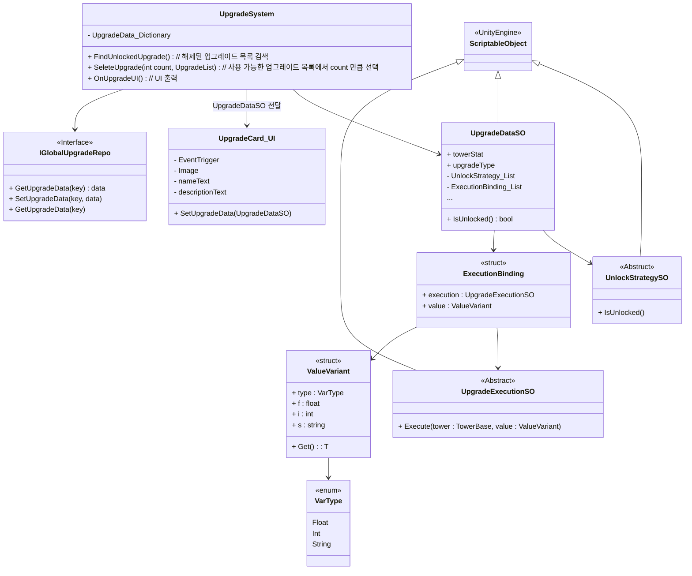
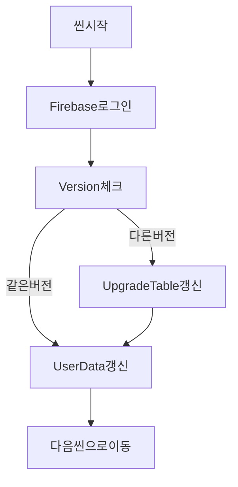

## 개발 일지
#### 개발 과정
#### 25.04 ~ 05
- [4~5월 개발 일지](/_Doc/DevelopmentLog.md)
#### 25.06
- [2025.06.17 / Upgrade System 구조 변경](#upgrade-system-구조-변경)
- [2025.06.23 / 초기화 씬 구성](#초기화-씬-구성)
---
#### 2025.06.17
### Upgrade System 구조 변경
1. **설계 내용**
  - **확장성** 조건 로직을 UnlockStrategySO로 모듈화로 새 조건 추가 시 코드 수정 없이 SO만 생성
  - **수정 자율성** UpgradeDataSO와 Unlocked(조건), Execution(실행) 리스트를 인스펙터에서 조합
  - **테스트** Unlock 로직을 단위 테스트 가능
2. **데이터 흐름**
- `UpgradeSystem.OnUpgradeUI` 호출
- `_upgradeDictionary`에서 후보 `UpgradeDataSO` 로드
- 각 `UpgradeDataSO.IsUnlocked()` 호출 → 잠금/해금 필터링
- `SelectUpgrade(count, unlockedList)` 로 UI에 표시할 카드 서브셋 결정
- 각 카드에 `UpgradeCard_UI.SetUpgradeData` 바인딩 → UI 렌더링
- 플레이어 클릭 시 `UpgradeExecutionSO`의 `Execute` 적용
3. **Global 데이터 적용**
- Global 데이터의 경우 게임을 시작하면 변화 없이 항상 적용
- 게임 시작시 `UpgradeSystem`에서 `IGlobalUpgradeRepo`를 통해 데이터를 받아와 적용

3. **Class Diagram**

---
#### 2025.06.23
### 초기화 씬 구성
1. **이유**
- (가장 먼저 실행 되는)초기화 씬은 Network 연결의 이유로 제작 하였으며 순서는 다음과 같습니다.
3. **초기화 순서(실패시 기본적으로 같은 단계의 행동을 다시 시도합니다.)**

---

