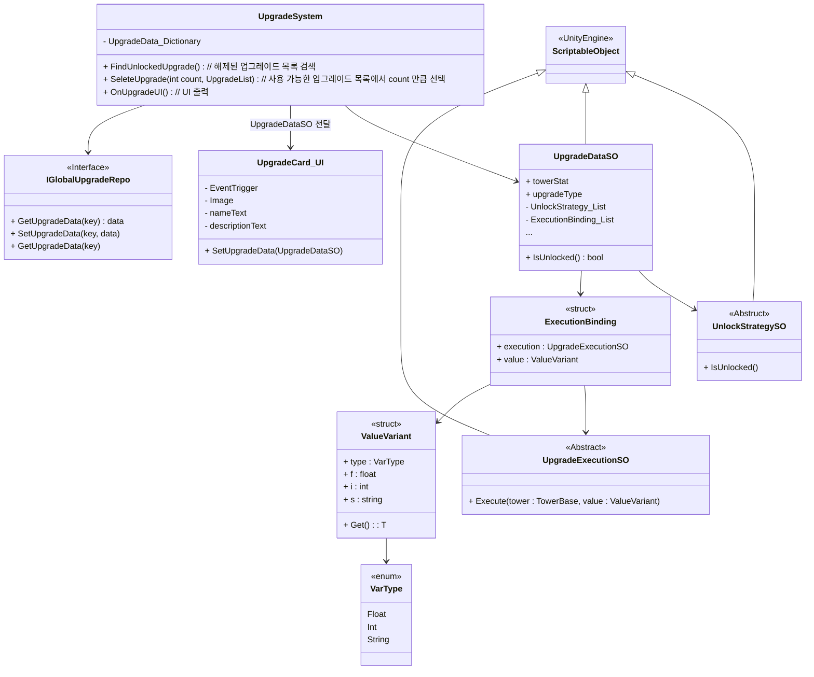
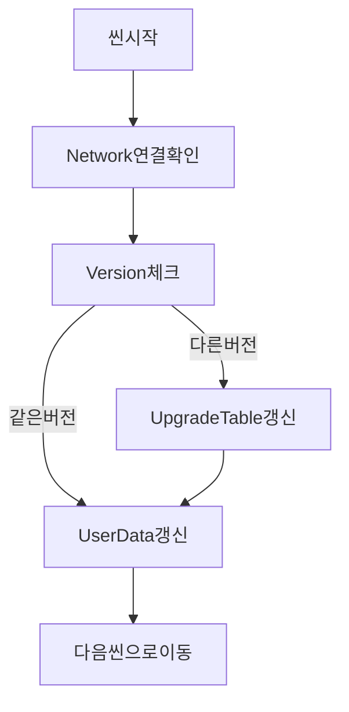

## 개발 일지
#### 개발 과정
#### 25.04 ~ 05
- [4~5월 개발 일지](/_Doc/DevelopmentLog.md)
#### 25.06
- [2025.06.17 / Upgrade System 구조 변경](#upgrade-system-구조-변경)
- [2025.06.23 / 초기화 씬 구성](#초기화-씬-구성)
- [2025.06.25 / Policy 관리](#policy-관리)
- [2025.06.28 / Contracts 계층 도입](#contracts-계층-도입)
---
#### 2025.06.17
### Upgrade System 구조 변경
1. **설계 내용**
  - **확장성** 조건 로직을 UnlockStrategySO로 모듈화로 새 조건 추가 시 코드 수정 없이 SO만 생성
  - **수정 자율성** UpgradeDataSO와 Unlocked(조건), Execution(실행) 리스트를 인스펙터에서 조합
  - **테스트** Unlock 로직을 단위 테스트 가능
2. **데이터 흐름**
- `UpgradeSystem.OnUpgradeUI` 호출
- `_upgradeDictionary`에서 후보 `UpgradeDataSO` 로드
- 각 `UpgradeDataSO.IsUnlocked()` 호출 → 잠금/해금 필터링
- `SelectUpgrade(count, unlockedList)` 로 UI에 표시할 카드 서브셋 결정
- 각 카드에 `UpgradeCard_UI.SetUpgradeData` 바인딩 → UI 렌더링
- 플레이어 클릭 시 `UpgradeExecutionSO`의 `Execute` 적용
3. **Global 데이터 적용**
- Global 데이터의 경우 게임을 시작하면 변화 없이 항상 적용
- 게임 시작시 `UpgradeSystem`에서 `IGlobalUpgradeRepo`를 통해 데이터를 받아와 적용


3. **Class Diagram**

---
#### 2025.06.23
### 초기화 씬 구성
1. **이유**
- (가장 먼저 실행 되는)초기화 씬은 Network 연결의 이유로 제작 하였으며</br>
`InitSceneManager`에서 관련 로직을 순서대로 진행합니다.
2. **초기화 순서(실패시 기본적으로 같은 단계의 행동을 다시 시도합니다.)**

---
#### 2025.06.25
### Policy 관리
1. **설계 의도**
- `Policy` 도입해 순수한 규칙을 한 곳에서 관리해서 유지보수성을 높였습니다.
- 추후 변경될수 있는 난이도에 `Policy` 변경을 통해 쉽게 변경되도록 설계
- (Gold, HP, Exp) 등 관리
2. **Bind 위치**
- `PlaySceneInstaller`에서 Bind를 하여 관리합니다. (PlayScene에서만 사용)
3. **Ex)**
```C#
public interface IGoldPolicy
{
    // enemy Kill했을때 골드 보상
    public int CalculateKillReward(EnemyData enemyData);
    // 시작 골드
    public int GetPlayerStartGold();
}
// 구현부
public class GoldPolicy : IGoldPolicy
...
```
---
#### 2025.06.28
### Contracts 계층 도입
1. **도입 배경**
- 프로젝트는 기본적으로 `GamePlay`계층 에서 `UI` 계층을 참조하는 구조를 가지고 있습니다.
- **(문제점)** `UI`에서 `GamePlay` 계층을 참조하려고 하면 **순환 참조 문제**가 발생합니다.
- 이러한 문제를 해결하자고 `Contracts` 계층을 도입하였습니다.
- 예를들면 `UI` 계층의 `UI.PurchaseTowerViewModel`에서 `GamePlay.Serivece`의 `TryPurchase`를 호출 하고자합니다.
- `Interface`를 `Contracts` 계층에 구현하여 `Contracts.ITowerPurchaseService` GamePlay의 `GamePlay.TowerPurchaseService`를 Bind하여 사용합니다.

2. **예상되는 결과**
- 순환 참조 오류 제거
- UI 계층은 인터페이스만 의존하여 직접 참조 없이 서비스 호출
- (단점) 설계마다 Bind 해야 하는 불편함
3. **Ex)**
``` C#
// Contracts
public interface ITowerPurchaseService {
    bool TryPurchase();
}

// GamePlay
public class TowerPurchaseService : ITowerPurchaseService { … }

// UI
[Inject] ITowerPurchaseService _svc;

// Installer
Container.Bind<ITowerPurchaseService>().To<TowerPurchaseService>() 로 런타임 Bind
```
