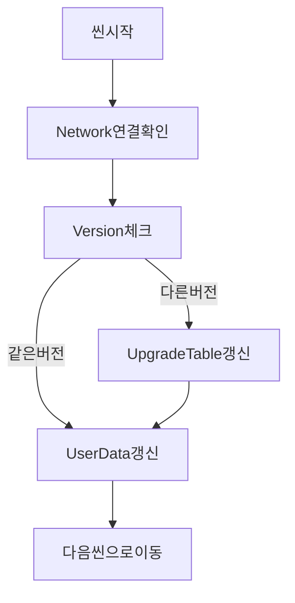
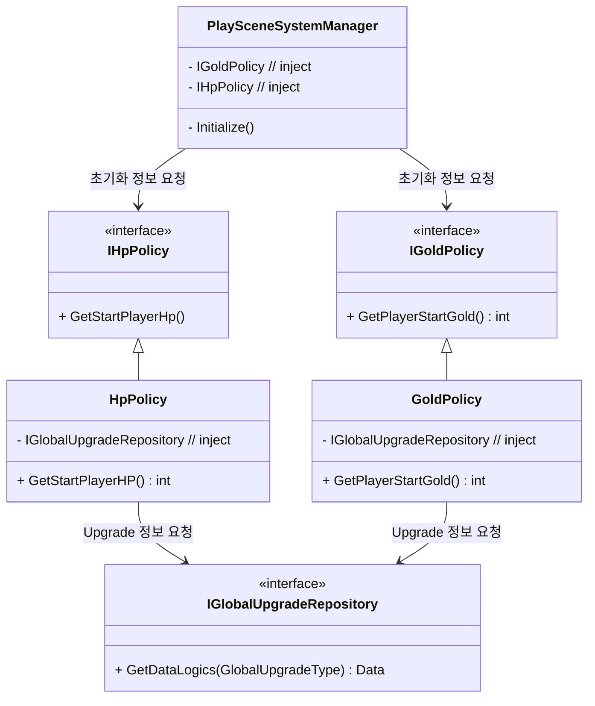
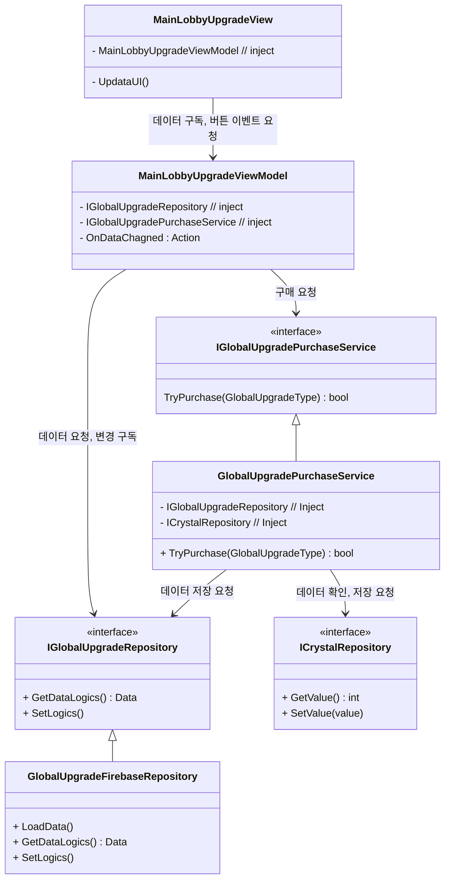
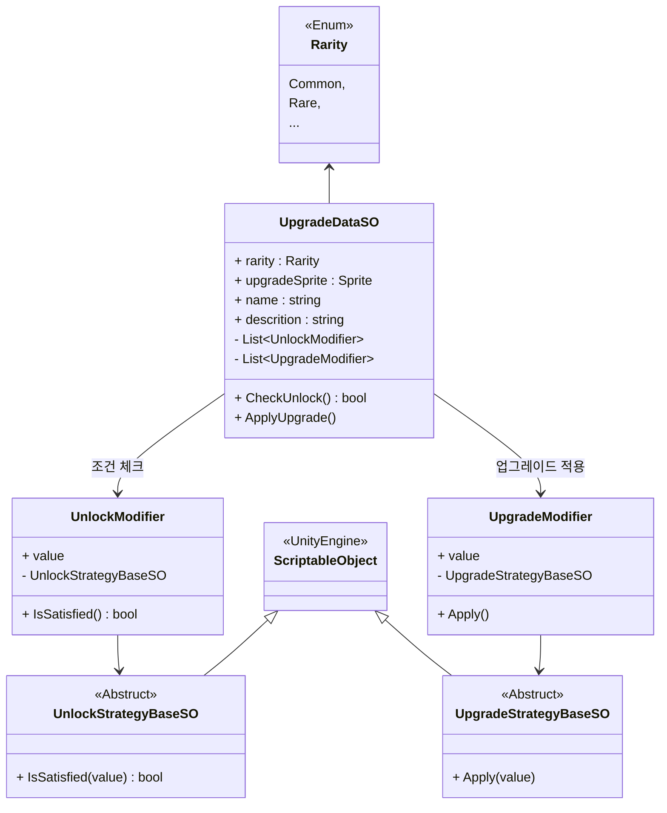
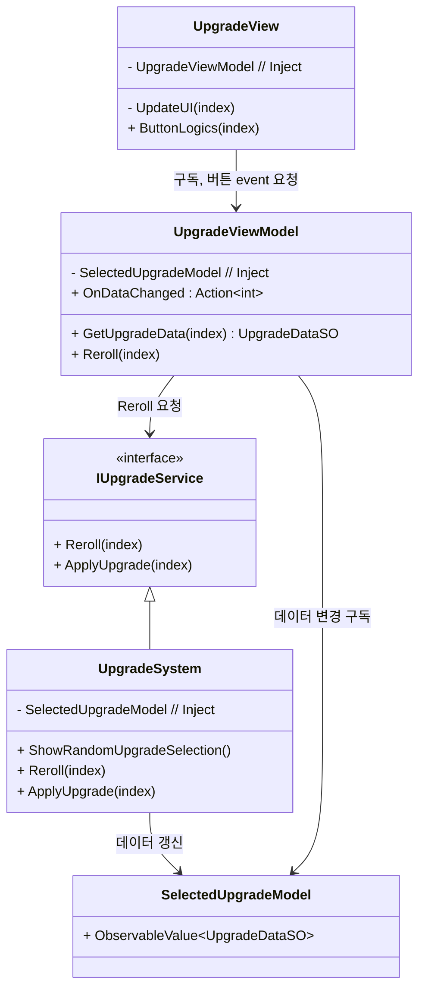

## 개발 일지
#### 개발 과정
#### 25.04 ~ 05
- [4~5월 개발 일지](/_Doc/DevelopmentLog.md)
#### 25.06
- [2025.06.23 / 초기화 씬 구성](#초기화-씬-구성)
- [2025.06.25 / Policy 관리](#policy-관리)
- [2025.06.28 / Contracts 계층 도입](#contracts-계층-도입)
- [2025.06.29 / Global Upgrade 구조](#global-upgrade-구조)
#### 25.07
- [2025.07.2 / Upgrade 구조](#upgrade-구조)
---
#### 2025.06.23
### 초기화 씬 구성
1. **이유**
- (가장 먼저 실행 되는)초기화 씬은 Network 연결의 이유로 제작 하였으며</br>
`InitSceneManager`에서 관련 로직을 순서대로 진행합니다.
2. **초기화 순서(실패시 기본적으로 같은 단계의 행동을 다시 시도합니다.)**

---
#### 2025.06.25
### Policy 관리
1. **설계 의도**
- `Policy` 도입해 순수한 규칙을 한 곳에서 관리해서 유지보수성을 높였습니다.
- 추후 변경될수 있는 난이도에 `Policy` 변경을 통해 쉽게 변경되도록 설계
- (Gold, HP, Exp) 등 관리
2. **Bind 위치**
- `PlaySceneInstaller`에서 Bind를 하여 관리합니다. (PlayScene에서만 사용)
3. **Ex)**
```C#
public interface IGoldPolicy
{
    // enemy Kill했을때 골드 보상
    public int CalculateKillReward(EnemyData enemyData);
    // 시작 골드
    public int GetPlayerStartGold();
}
// 구현부
public class GoldPolicy : IGoldPolicy
...
```
---
#### 2025.06.28
### Contracts 계층 도입
1. **도입 배경**
- 프로젝트는 기본적으로 `GamePlay`계층 에서 `UI` 계층을 참조하는 구조를 가지고 있습니다.
- **(문제점)** `UI`에서 `GamePlay` 계층을 참조하려고 하면 **순환 참조 문제**가 발생합니다.
- 이러한 문제를 해결하자고 `Contracts` 계층을 도입하였습니다.
- 예를들면 `UI` 계층의 `UI.PurchaseTowerViewModel`에서 `GamePlay.Serivece`의 `TryPurchase`를 호출 하고자합니다.
- `Interface`를 `Contracts` 계층에 구현하여 `Contracts.ITowerPurchaseService` GamePlay의 `GamePlay.TowerPurchaseService`를 Bind하여 사용합니다.

2. **예상되는 결과**
- 순환 참조 오류 제거
- UI 계층은 인터페이스만 의존하여 직접 참조 없이 서비스 호출
- (단점) 설계마다 Bind 해야 하는 불편함
3. **Ex)**
``` C#
// Contracts
public interface ITowerPurchaseService {
    bool TryPurchase();
}

// GamePlay
public class TowerPurchaseService : ITowerPurchaseService { … }

// UI
[Inject] ITowerPurchaseService _svc;

// Installer
Container.Bind<ITowerPurchaseService>().To<TowerPurchaseService>() 로 런타임 Bind
```
---
#### 2025.06.29
### Global Upgrade 구조
1. **설계 내용** </br>
Global Upgrade는 게임 전체에 적용되는 업그레이드 시스템입니다. </br>  
기본적으로 다음과 같은 특성을 고려하여 설계되었습니다: 
- 글로벌 업그레이드는 **게임 플레이 도중 변경되지 않으며**, 게임 시작 시점에만 적용됨 
- 데이터는 `IGlobalUpgradeRepository`를 통해 외부(Firebase 등)에서 로드
- 실제 적용은 게임 시작 시, **초기 상태를 설정하는 Policy 계층**에서 수행
- 적용 대상은 플레이어 HP, 시작 골드, 추가 경험치 등의 게임 초기 파라미터

2. **Global Upgrade 적용 구조** </br>
PlaySceneSystemManager는 게임 시작 시점에 Policy 객체를 통해 초기값을 조회 </br>
Policy 객체는 IGlobalUpgradeRepository를 통해 업그레이드 수치를 간접적으로 참조 </br>
로직은 테스트, 난이도 변경 등 바꿀수 있는 가능성을 고려하여 interface 중심 구조로 Bind를 통하여 쉽게 교체 가능하도록 설계</br>

3. **UI** </br>
업그레이드 UI는 메인 로비에 위치하며, 유저가 직접 업그레이드를 구매하거나 상태를 확인할 수 있도록 구성되어 있습니다.</br>

- **UI 흐름 요약:**
- View → ViewModel: 버튼 클릭 이벤트, UI 갱신 요청
- ViewModel → Service/Repo: 구매 요청 또는 데이터 요청
- Service → Repo: 크리스탈 확인 후 업그레이드 수치 갱신
- OnDataChanged 이벤트 → View: UI 반영


---
#### 2025.07.02
### Upgrade 구조
1. **설계 배경** </br>
Upgrade 기능은 성장의 핵심 축으로, 다양한 업그레이드를 카드 형태로 선택하고, 조건에 따라 해금 되도록 설계를 했습니다. </br>
핵심 구조는 `UpgradeDataSO` `UnlockStrategyBaseSO`(조건), `UpgradeStrategyBaseSO`(적용), `UI`로 나눠집니다. </br>
- **확장성** - 조건 로직을 `UnlockStrategyBaseSO`, 적용 로직을 `UpgradeStrategyBaseSO`으로 모듈화 하여 확장성을 확보.
- **수정 자율성** - `UpgradeDataSO`와 Unlocked(조건), Apply(적용) 리스트를 인스펙터에서 조합.
2. **`UpgradeDataSO` 의 구조** </br>
업그레이드의 실체는 `UpgradeDataSO`이며, 해금 조건(`UnlockModifier`)과 효과 적용(`UpgradeModifier`)을 각각 전략 객체로 위임하여 유연성과 확장성을 확보했습니다. </br>  
전략은 `ScriptableObject` 기반으로 제작되어 인스펙터에서 쉽게 조합 가능하며, 조건 추가/변경 시 코드 수정 없이 SO만 교체하면 되도록 설계했습니다. </br>


3. **Upgrade UI 상호 작용** </br>
UI는 `View` ↔ `ViewModel` ↔ `Model`,`Serivce` 구조를 따릅니다. </br>
업그레이드 선택/리롤은 버튼 입력을 통해 `ViewModel`에 행동이 위임되며</br> 
`ViewModel`은 `SelectedUpgradeModel`과 `IUpgradeService`에 요청을 분리하여 전달합니다. </br>


