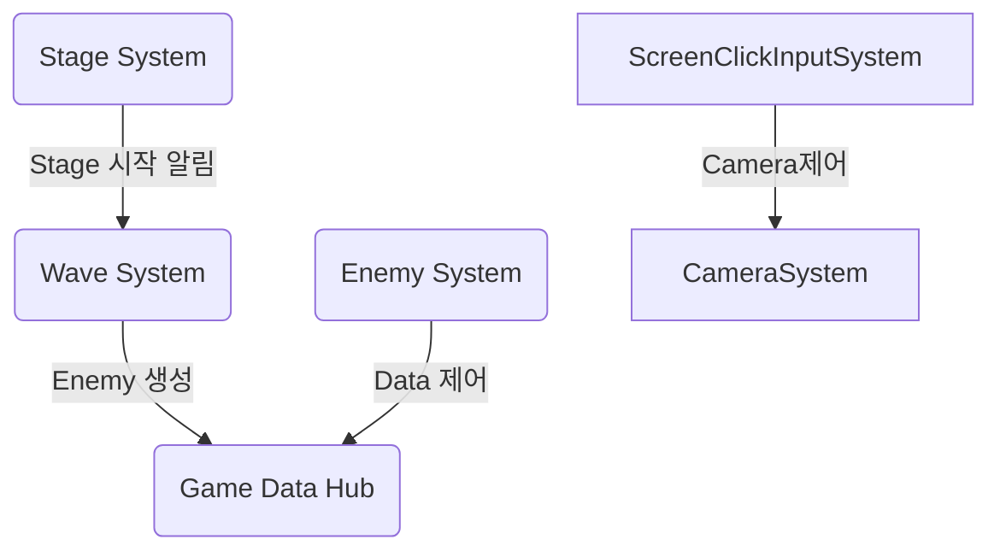
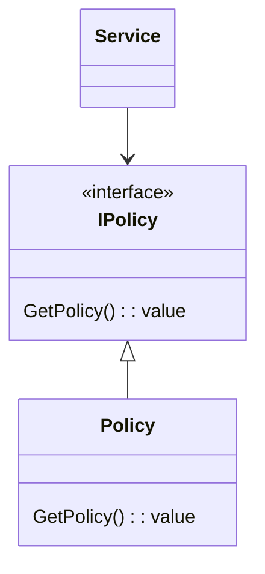
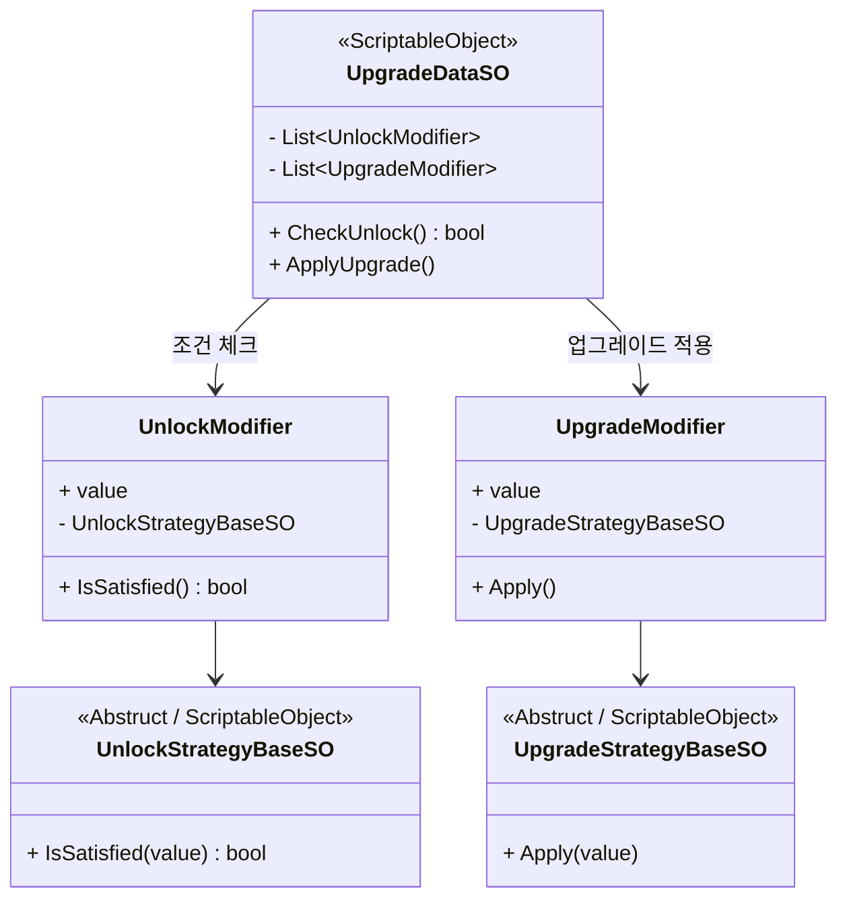

- [System 문서](../_Doc/System.md)
## 목차 
1. [System](#system)
2. [Policy](#policy)
3. [Service](#service)
4. [Upgrade](#upgrade)
--- 
## System
System은 Play Scene에서 사용 되며 게임 흐름의 핵심 부분입니다. </br>
System의 역할을 다음과 같습니다.</br>
- [**`MapSystem`**](../GamePlay/System/MapSystem.cs) : 맵 데이터 생성, 맵 오브젝트 생성
- [**`ScreenClickInputSystem`**](../GamePlay/System/ScreenClickInputSystem.cs) : Input 관리
- [**`EnemySystem`**](../GamePlay/System/EnemySystem.cs) : Enemy 행동 제어(DOD(Data Oriented Design) 구조)
- [**`StageSystem`**](../GamePlay/System/StageSystem.cs) : 스테이지 시작과 종료
- [**`WaveSystem`**](../GamePlay/System/WaveSystem.cs) : 스테이지 Level에 맞는 Wave(enemy) 생성
- [**`CameraSystem`**](../GamePlay/System/CameraSystem.cs) : 카메라 제어
- [**`TowerSystem`**](../GamePlay/System/TowerSystem.cs) : 타워 생성, 제거, 위치 변경
- [**`UpgradeSystem`**](../GamePlay/System/UpgradeSystem.cs) : 업그레이드

각 시스템은 [`PlaySceneSystemManager`](../GamePlay/PlaySceneSystemManager.cs)에서 이벤트 구독 초기화를 통해 연결됩니다.</br>
`PlaySceneSystemManager`에서 연결 되는 목록은 다음과 같습니다. 

---
## Policy
`Policy`는 게임의 비지니스 로직 영역을 정의하는 부분입니다. </br>
주로 경험치, 게임 재화, 체력 등 인게임에서 사용되는 부분을 정의합니다.</br> 
전체적 구조는 다음과 같습니다.</br>

Policy는 구현 계층에 해당하며, 각 난이도(예: Easy, Normal, Hard)에 맞게 확장 가능하도록 설계되었습니다.</br>
난이도별로 적절한 Policy를 바인딩(Bind)하여 사용할 수 있도록 설계된 구조입니다.</br>
- Bind 예시 [NormarInstaller](../Core/NormarInstaller.cs) </br>

Policy를 교체함으로써 난이도에 따른 로직 변경이 용이하며, 유연한 확장성을 확보할 수 있습니다.</br>

Policy 목록은 다음과 같습니다.</br>
- [`ExpPolicy`](../GamePlay/_Policy/ExpPolicy.cs) : 경험치 정책
- [`GoldPolicy`](../GamePlay/_Policy/GoldPolicy.cs) : 골드 정책
- [`HpPolicy`](../GamePlay/_Policy/HpPolicy.cs) : Hp 정책
- [`RewardPolicy`](../GamePlay/_Policy/RewardPolicy.cs) : 보상 정책
- [`TowerPricePolicy`](../GamePlay/_Policy/TowerPricePolicy.cs) : 타워 정책

---
## Service
`Service` 어플리케이션 로직을 정의하며 각 데이터를 참고해 특정 작업을 수행해줍니다.</br>
- [`TowerPurchaseService`](../GamePlay/_Service/TowerPurchaseService.cs) : 타워 구매
- [`SellTowerService`](../GamePlay/_Service/SellTowerService.cs) : 타워 판매
- [`SceneTransitionService`](../GamePlay/_Service/SceneTransitionService.cs) : 씬 이동
- [`RewardService`](../GamePlay/_Service/RewardService.cs) : 보상 획득
- [`UpgradeService`](../GamePlay/_Service/UpgradeService.cs) : 업그레이드 적용, 리롤    
- [`GlobalUpgradePurchaseService`](../GamePlay/_Service/GlobalUpgradePurchaseService.cs) : 글로벌 업그레이드 적용
- [`NetworkManager`](../Network/NetworkManager.cs) : 각종 Network 관련 Service들

---
## System 
1. **Upgrade 구조** </br>
Upgrade 확장은 `Unlock` 조건과 `Apply` 적용으로 나눠집니다.
- [**`UnlockStrategyBaseSO`**](../Data/Upgrade/UnlockStrategyBaseSO.cs) : 해금 조건으로 특정 조건을 만족했을때 업그레이드 선택 목록에 나타남 (특정 스테이지 이상, 특정 HP 이하 등)
- [**`UpgradeStrategyBaseSO`**](../Data/Upgrade/UpgradeStrategyBaseSO.cs) : 적용으로 업그레이드를 실제 수행함 (Tower 공격력 증가, 골드 증가 등)
`Abstruct` 클래스인 `Base`를 상속받아서 각 구현하여 확장해 나갑니다.

2. **Class Diagram**

3. **Ex)**
```C#
///// Unlock
    /// <summary>
    /// 특정 스테이지 아래 있나 체크
    /// </summary>
    [CreateAssetMenu(fileName = "UnlockStageUnderSO", menuName = "Scriptable Objects/Unlock/UnlockStageUnderSO")]
    public class UnlockStageUnderSO : UnlockStrategyBaseSO {
        [Inject] private WaveStatusModel _waveModel;
        public override bool IsSatisfied(float value) {
            return _waveModel.waveLevelObservable.Value < (int)value;
        }
    }
/////////////////////////////////////////////////////////////////////////////////////////
///// Apply
     /// <summary>
    /// HP 회복
    /// </summary>
    [CreateAssetMenu(fileName = "RecoveryHPSO", menuName = "Scriptable Objects/Upgrade/RecoveryHPSO")]
    public class RecoveryHPSO : UpgradeStrategyBaseSO {
        [Inject] private HpModel _hpModel;
        public override void Apply(float value) {
            // 최대 체력을 못넘게 범위 제한
            _hpModel.curHpObservable.Value = Mathf.Min(_hpModel.curHpObservable.Value + (int)value, _hpModel.maxHpObservable.Value);
        }
    }
```
4. **Editor**
`ScriptableObject` 기반으로 제작되어 인스펙터에서 쉽게 조합 가능하며, 조건 추가/변경 시 코드 수정 없이 SO만 교체하면 되도록 하여 확장성을 확보 하였습니다. </br>
개발자는 `UnlockStrategyBaseSO`, `UpgradeStrategyBaseSO`을 상속받아 구현하고, 기획자가 직접 인스펙터에서 조합하여 수정할수 있도록 하였습니다.


