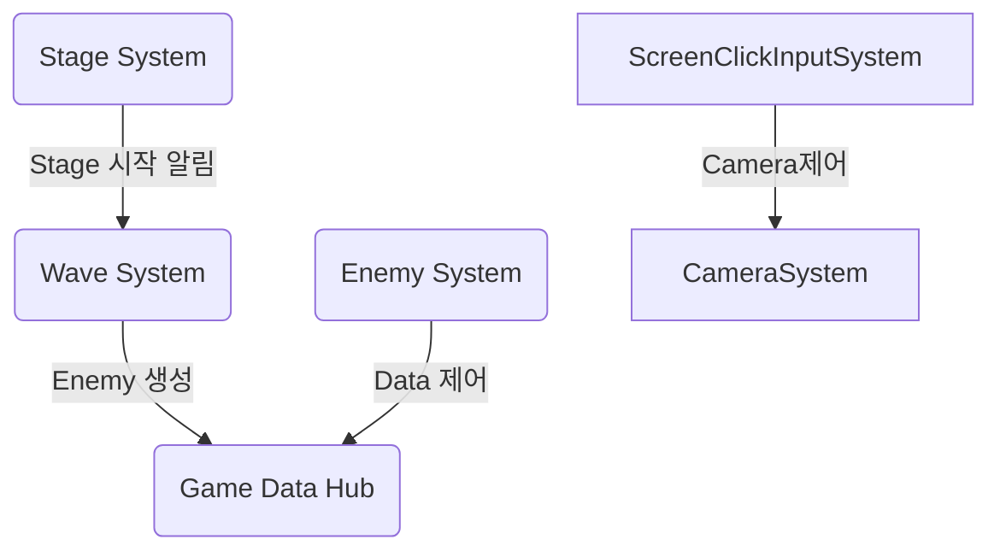
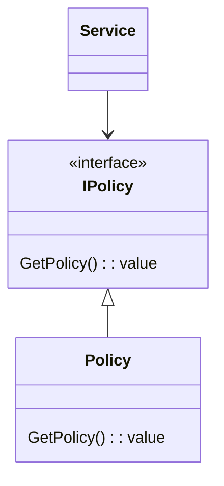

## 목차 
1. [System](#system)
2. [Policy](#policy)
3. [Service](#service)
--- 
## System
System은 Play Scene에서 사용 되며 게임 흐름의 핵심 부분입니다.  
System의 역할을 다음과 같습니다. 
- [**MapSystem:**](../GamePlay/System/MapSystem.cs) 맵 데이터 생성, 맵 오브젝트 생성
- [**ScreenClickInputSystem:**](../GamePlay/System/ScreenClickInputSystem.cs) Input 관리
- [**EnemySystem:**](../GamePlay/System/EnemySystem.cs) Enemy 행동 제어(DOD(Data Oriented Design) 구조)
- [**StageSystem:**](../GamePlay/System/StageSystem.cs) 스테이지 시작과 종료
- [**WaveSystem:**](../GamePlay/System/WaveSystem.cs) 스테이지 Level에 맞는 Wave(enemy) 생성
- [**CameraSystem:**](../GamePlay/System/CameraSystem.cs) 카메라 제어
- [**TowerSystem:**](../GamePlay/System/TowerSystem.cs) 타워 생성, 제거, 위치 변경
- [**UpgradeSystem:**](../GamePlay/System/UpgradeSystem.cs) 업그레이드

각 시스템은 [`PlaySceneSystemManager`](../GamePlay/PlaySceneSystemManager.cs)에서 이벤트 구독 초기화를 통해 연결됩니다. 
`PlaySceneSystemManager`에서 연결 되는 목록은 다음과 같습니다. 

---
## Policy
`Policy`는 게임의 비지니스 로직 영역을 정의하는 부분입니다.  
주로 경험치, 게임 재화, 체력 등 인게임에서 사용되는 부분을 정의합니다.  
전체적 구조는 다음과 같습니다. 

Policy는 구현 계층에 해당하며, 각 난이도(예: Easy, Normal, Hard)에 맞게 확장 가능하도록 설계되었습니다. 
난이도별로 적절한 Policy를 바인딩(Bind)하여 사용할 수 있도록 설계된 구조입니다. 
Bind 예시 [NormarInstaller](../Core/NormarInstaller.cs) 
Policy를 교체함으로써 난이도에 따른 로직 변경이 용이하며, 유연한 확장성을 확보할 수 있습니다. 
Policy 목록은 다음과 같습니다. 
- [ExpPolicy](../GamePlay/_Policy/ExpPolicy.cs)
- [GoldPolicy ](../GamePlay/_Policy/GoldPolicy.cs)
- [HpPolicy](../GamePlay/_Policy/HpPolicy.cs)
- [RewardPolicy](../GamePlay/_Policy/RewardPolicy.cs)
- [TowerPricePolicy](../GamePlay/_Policy/TowerPricePolicy.cs)

---
## Service
