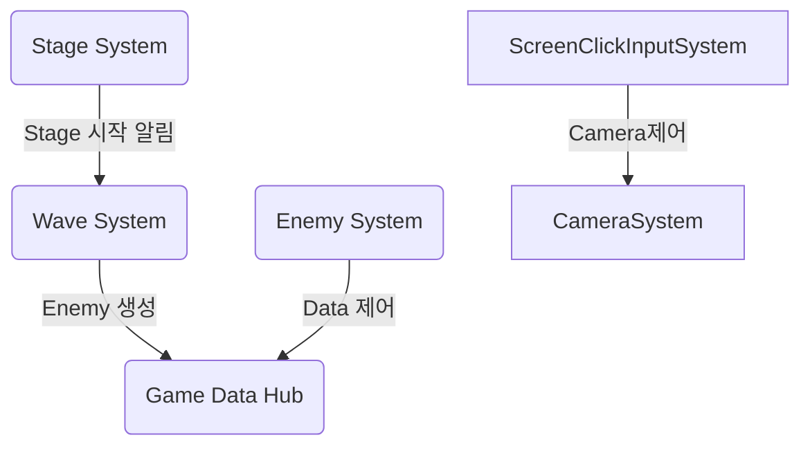
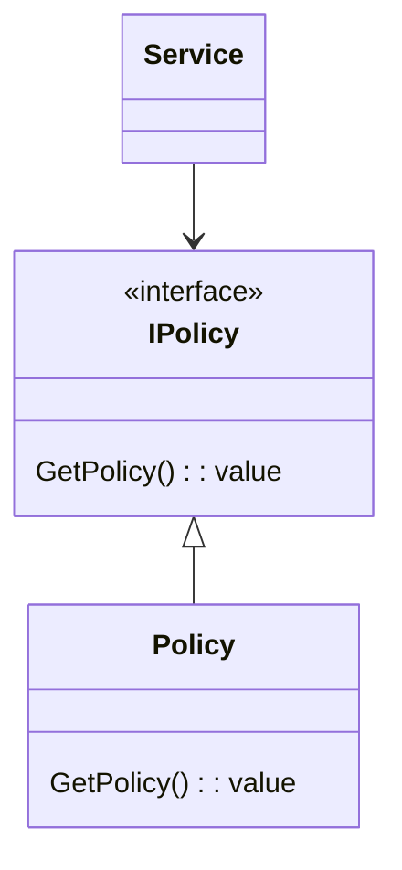
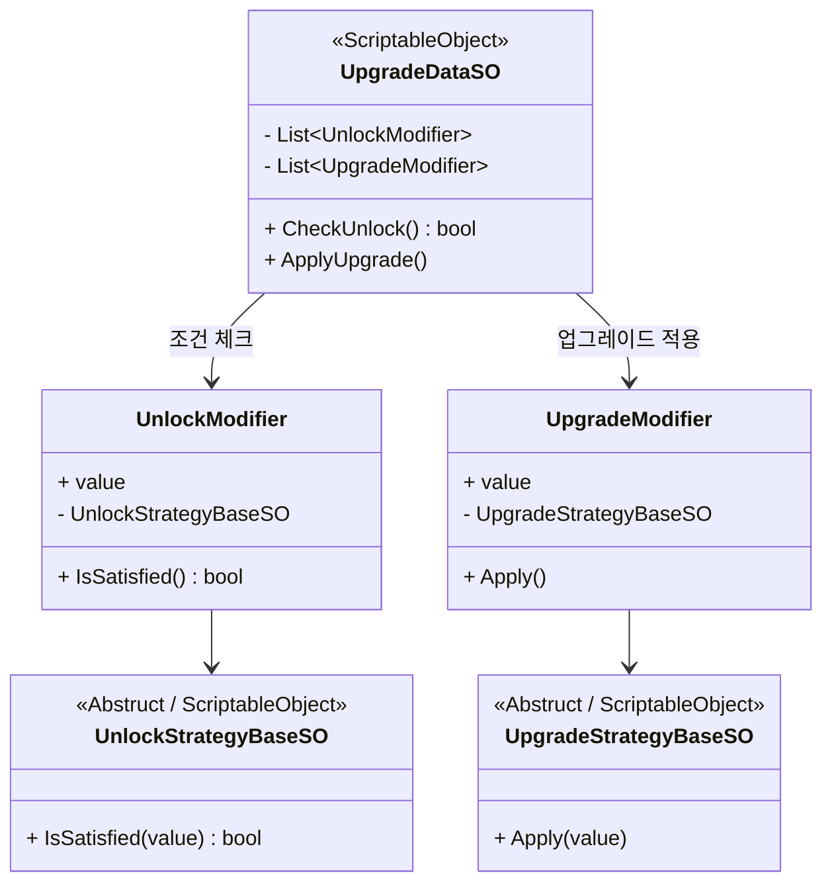
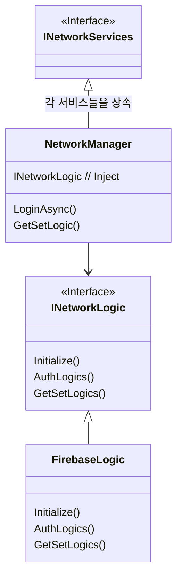
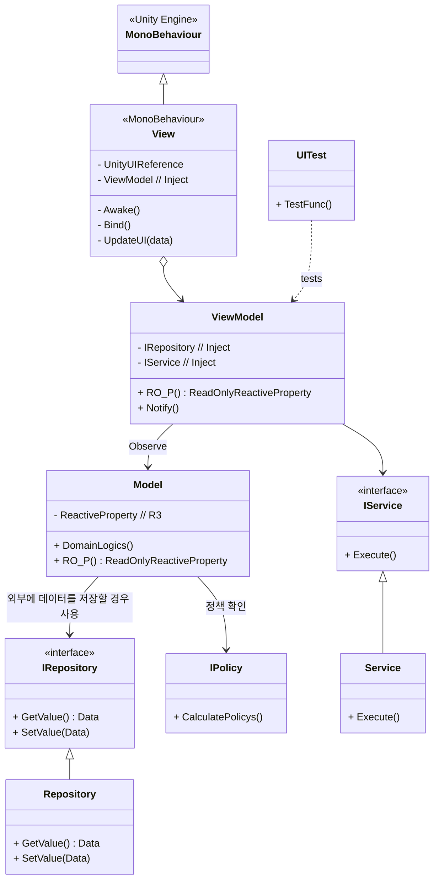

- [System 문서](../_Doc/System.md)
## 목차 
1. [System](#system)
2. [Policy](#policy)
3. [Service](#service)
4. [Upgrade](#upgrade)
5. [Network](#network)
6. [UI](#ui)
--- 
## System
System은 Play Scene에서 사용 되며 게임 흐름의 핵심 부분입니다. </br>
System의 역할을 다음과 같습니다.</br>
  
| 클래스                                              | 설명                      |
| ------------------------------------------------ | ----------------------- |
| [**`MapSystem`**](../GamePlay/System/MapSystem.cs)                             | 맵 데이터 생성, 맵 오브젝트 생성 |
| [**`ScreenClickInputSystem`**](../GamePlay/System/ScreenClickInputSystem.cs)   | Input 관리 |
| [**`EnemySystem`**](../GamePlay/System/EnemySystem.cs)                         | Enemy 행동 제어(DOD(Data Oriented Design) 구조) |
| [**`StageSystem`**](../GamePlay/System/StageSystem.cs)                         | 스테이지 시작과 종료 |
| [**`WaveSystem`**](../GamePlay/System/WaveSystem.cs)                           | 스테이지 Level에 맞는 Wave(enemy) 생성 |
| [**`CameraSystem`**](../GamePlay/System/CameraSystem.cs)                       | 카메라 제어 |
| [**`TowerSystem`**](../GamePlay/System/TowerSystem.cs)                         | 타워 생성, 제거, 위치 변경 |
| [**`UpgradeSystem`**](../GamePlay/System/UpgradeSystem.cs)                     | 업그레이드 |

각 시스템은 [`PlaySceneSystemManager`](../GamePlay/PlaySceneSystemManager.cs)에서 이벤트 구독 초기화를 통해 연결됩니다.</br>
`PlaySceneSystemManager`에서 연결 되는 목록은 다음과 같습니다. 

---
## Policy
`Policy`는 게임의 비지니스 로직 영역을 정의하는 부분입니다. </br>
주로 경험치, 게임 재화, 체력 등 인게임에서 사용되는 부분을 정의합니다.</br> 
전체적 구조는 다음과 같습니다.</br>

Policy는 구현 계층에 해당하며, 각 난이도(예: Easy, Normal, Hard)에 맞게 확장 가능하도록 설계되었습니다.</br>
난이도별로 적절한 Policy를 바인딩(Bind)하여 사용할 수 있도록 설계된 구조입니다.</br>
- Bind 예시 [NormarInstaller](../Core/NormarInstaller.cs) </br>

Policy를 교체함으로써 난이도에 따른 로직 변경이 용이하며, 유연한 확장성을 확보할 수 있습니다.</br>

Policy 목록은 다음과 같습니다.</br>

| 클래스                                              | 설명                      |
| ------------------------------------------------ | ----------------------- |
| [`ExpPolicy`](../Domain/_Policy/ExpPolicy.cs) | 경험치 정책 |
| [`GoldPolicy`](../Domain/_Policy/GoldPolicy.cs) | 골드 정책 |
| [`HpPolicy`](../Domain/_Policy/HpPolicy.cs) | Hp 정책 |
| [`RewardPolicy`](../Domain/_Policy/RewardPolicy.cs) | 보상 정책 |
| [`TowerPricePolicy`](../Domain/_Policy/TowerPricePolicy.cs) | 타워 정책 |


---
## Service
`Service` 어플리케이션 로직을 정의하며 각 데이터를 참고해 특정 작업을 수행해줍니다.</br>

| 클래스                                              | 설명                      |
| ------------------------------------------------ | ----------------------- |
| [`TowerPurchaseService`](../GamePlay/_Service/TowerPurchaseService.cs) | 타워 구매 |
| [`SellTowerService`](../GamePlay/_Service/SellTowerService.cs) | 타워 판매 |
| [`SceneTransitionService`](../GamePlay/_Service/SceneTransitionService.cs) | 씬 이동 |
| [`RewardService`](../GamePlay/_Service/RewardService.cs) | 보상 획득 |
| [`UpgradeService`](../GamePlay/_Service/UpgradeService.cs) | 업그레이드 적용, 리롤 |    
| [`GlobalUpgradePurchaseService`](../GamePlay/_Service/GlobalUpgradePurchaseService.cs) | 글로벌 업그레이드 적용 |
| [`NetworkManager`](../Network/NetworkManager.cs) | 각종 Network 관련 Service들 |

---
## Upgrade
1. **Upgrade 구조** </br>
Upgrade 확장은 `Unlock` 조건과 `Apply` 적용으로 나눠집니다.

| 클래스                                              | 설명                      |
| ------------------------------------------------ | ----------------------- |
| [`UnlockStrategyBaseSO`](../Data/Upgrade/UnlockStrategyBaseSO.cs) | 해금 조건으로 특정 조건을 만족했을때 업그레이드 선택 목록에 나타남 (특정 스테이지 이상, 특정 HP 이하 등) |
| [`UpgradeStrategyBaseSO`](../Data/Upgrade/UpgradeStrategyBaseSO.cs) | 적용으로 업그레이드를 실제 수행함 (Tower 공격력 증가, 골드 증가 등) | 

`Abstruct` 클래스인 `Base`를 상속받아서 각 구현하여 확장해 나갑니다.

2. **Class Diagram**

3. **Ex)**
```C#
///// Unlock
    /// <summary>
    /// 특정 스테이지 아래 있나 체크
    /// </summary>
    [CreateAssetMenu(fileName = "UnlockStageUnderSO", menuName = "Scriptable Objects/Unlock/UnlockStageUnderSO")]
    public class UnlockStageUnderSO : UnlockStrategyBaseSO {
        [Inject] private WaveStatusModel _waveModel;
        public override bool IsSatisfied(float value) {
            return _waveModel.waveLevelObservable.Value < (int)value;
        }
    }
/////////////////////////////////////////////////////////////////////////////////////////
///// Apply
     /// <summary>
    /// HP 회복
    /// </summary>
    [CreateAssetMenu(fileName = "RecoveryHPSO", menuName = "Scriptable Objects/Upgrade/RecoveryHPSO")]
    public class RecoveryHPSO : UpgradeStrategyBaseSO {
        [Inject] private HpModel _hpModel;
        public override void Apply(float value) {
            // 최대 체력을 못넘게 범위 제한
            _hpModel.curHpObservable.Value = Mathf.Min(_hpModel.curHpObservable.Value + (int)value, _hpModel.maxHpObservable.Value);
        }
    }
```
4. **Editor**
`ScriptableObject` 기반으로 제작되어 인스펙터에서 쉽게 조합 가능하며, 조건 추가/변경 시 코드 수정 없이 SO만 교체하면 되도록 하여 확장성을 확보 하였습니다. </br>
개발자는 `UnlockStrategyBaseSO`, `UpgradeStrategyBaseSO`을 상속받아 구현하고, 기획자가 직접 인스펙터에서 조합하여 수정할수 있도록 하였습니다.


---
## Network
Network 계층은 Firebase의 Realtime Database와 Authentication을 기반으로 구현되었습니다. </br>
추후 AWS, 로컬 서버 등 다른 백엔드 서비스로의 확장을 고려해 유연하고 모듈화된 구조로 설계되었습니다.

1. **`Firebasse Database`** 구조 </br>
- `UpgradeTable`
  - `[Global Upgrade Data]` : 글로벌 업그레이드 수치 데이터
  - `Version` : Version을 확인하여 업데이트를 할지 결정
- `UserData`
  - `[UID]` : 유저별 고유 식별자 UID를 기준으로 데이터 저장
      - `Crystal` :  보유 크리스탈 수
      - `Upgrade` : 유저가 보유한 업그레이드 정보
          - [Data]  : 업그레이드 타입별 레벨 정보 저장

2. **Network 구조** </br>
Network 계층은 다음과 같은 구성으로 설계되어 있으며, 의존성 주입(Dependency Injection)을 통해 외부에서 로직 구현체를 변경할 수 있도록 유연하게 처리했습니다.

| 클래스                                              | 설명                      |
| ------------------------------------------------ | ----------------------- |
| [`NetworkManager`](../Network/NetworkManager.cs) | 외부에서 호출 가능한 네트워크 진입점    |
| [`INetworkLogic`](../Network/INetworkLogic.cs)   | 네트워크 동작에 대한 인터페이스 정의    |
| [`FirebaseLogic`](../Network/FirebaseLogic.cs)   | 실제 Firebase 로직을 구현한 클래스 |

- **설계 배경** </br>
Firebase 외에도 AWS, 로컬 서버 등 다른 백엔드로의 교체 가능성을 고려해, </br>
모든 핵심 기능은 INetworkLogic 인터페이스를 통해 추상화되었습니다.

- **핵심 목표**</br>
 INetworkLogic 인터페이스를 기준으로 다양한 구현체 (FirebaseLogic, LocalNetworkLogic, AwsNetworkLogic 등)를 생성하여 유연하게 교체 가능하여 확장성을 열어 뒀습니다.


---

## UI
1. **설계 목적** </br>
UI는 복잡도와 확장 가능성에 따라 두 가지 방식으로 구성합니다.

- **MVVM(Model-View-ViewModel)**  
  데이터 규모가 크고, 향후 기능 추가·유지보수 가능성이 높은 화면에 적용합니다.  
  테스트 용이성, 재사용성, 의존성 분리 측면에서 유리합니다.

- **MonoBehaviour 단일 구조**  
  화면이 단순하고 로직이 고정적인 `UI`는 `MonoBehaviour` 하나로 구현하여 개발 효율을 높입니다.


2. **MVVM 계층 역할** </br>

| 계층            | 역할 요약  | 상세 설명                                                                                                          |
| ------------- | ------ | -------------------------------------------------------------------------------------------------------------- |
| **Model**     | 상태 관리  | - UI에서 사용할 상태 값을 보관<br>- 외부 데이터(Firebase 등)는 **Repository 패턴**으로 캡슐화<br>- 인게임 전용 데이터는 DI(의존성 주입)으로 전달받아 관리     |
| **ViewModel** | 중재자 역할 | - `View`와 `Model` 사이의 중재자 역할 수행<br>- `Event`를 사용하여 `View`와 데이터 바인딩<br>- 복잡한 도메인 로직은 \*\*`Service`\*\*를 주입받아 실행 |
| **View**      | UI 렌더링 | - Unity UI 요소를 렌더링하고 입력을 수집<br>- `ViewModel`의 `Event`를 구독해 UI 업데이트<br>- 버튼 등 UI 요소는 `ViewModel`의 로직을 통해 초기화    |

3.**의존성 주입 흐름** </br>

- **Repository**는 외부 데이터(Firebase 등)에 대한 모든 접근을 담당해 `ViewModel`에서 직접 접근하지 않습니다.  
- **ViewModel**은 `Repository/Model`에서 데이터를 받아와 가공하고, 필요한 경우 `Service`를 호출합니다.  
- 모든 의존성은 **Zenject**로 주입하며, 테스트 환경에서도 대체 가능한 구조를 유지합니다.

4. **UI Class Diagram**

