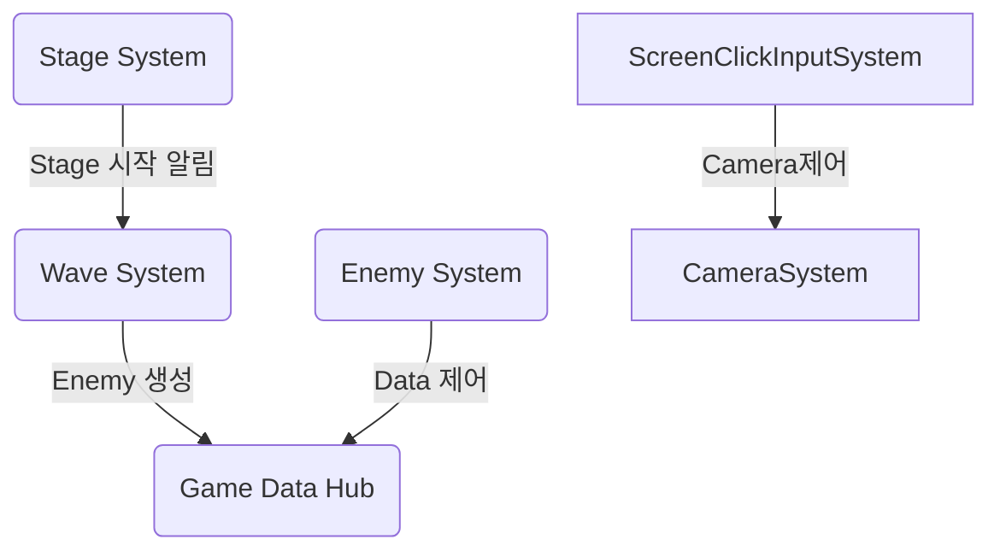

## 목차 
1. [System](#system)

--- 
## System
System은 Play Scene에서 사용 되며 게임 흐름의 핵심 부분입니다.  
System의 역할을 다음과 같습니다. 
- [**MapSystem:**](../GamePlay/System/MapSystem.cs) 맵 데이터 생성, 맵 오브젝트 생성
- [**ScreenClickInputSystem:**](../GamePlay/System/ScreenClickInputSystem.cs) Input 관리
- [**EnemySystem:**](../GamePlay/System/EnemySystem.cs) Enemy 행동 제어(DOD(Data Oriented Design) 구조)
- [**StageSystem:**](../GamePlay/System/StageSystem.cs) 스테이지 시작과 종료
- [**WaveSystem:**](../GamePlay/System/WaveSystem.cs) 스테이지 Level에 맞는 Wave(enemy) 생성
- [**CameraSystem:**](../GamePlay/System/CameraSystem.cs) 카메라 제어
- [**TowerSystem:**](../GamePlay/System/TowerSystem.cs) 타워 생성, 제거, 위치 변경
- [**UpgradeSystem:**](../GamePlay/System/UpgradeSystem.cs) 업그레이드

각 시스템은 [`PlaySceneSystemManager`](../GamePlay/PlaySceneSystemManager.cs)에서 이벤트 구독 초기화를 통해 연결됩니다. 
PlaySceneSystemManager에서 연결 되는 목록은 다음과 같습니다. 

---
