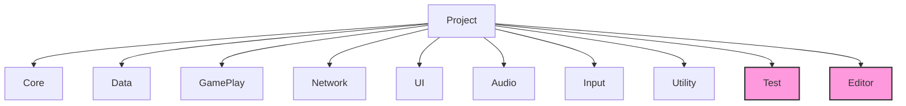

## 네임스페이스 설계

#### 1. Core
역할: 게임의 가장 근본적이고 핵심적인 기반 구조 및 로직. 
주요 내용: 게임 상태 관리, 씬 로딩, 핵심 게임 루프 관리.

#### 2. Data
역할: 게임 설정, 초기값, 영구 데이터 정의 및 관리. 
주요 내용: ScriptableObject 정의 (스탯, 정보 등), 설정 값, 데이터 테이블 구조, 데이터 저장/로드 인터페이스/기본 핸들러.

#### 3. GamePlay
역할: 실제 인게임 플레이 로직의 대부분. 핵심 게임 메커니즘 구현.  
주요 내용: 타워/적 로직 및 AI, 전투 시스템, 맵 시스템, 플레이어 상태(인게임), 로그라이크 요소, 아이템/스킬 로직.

#### 4. Network
역할: 외부 서버 통신 및 네트워크 관련 기능.  
주요 내용: Firebase 연동.

#### 5. UI
역할: 사용자 인터페이스 요소 표시, 상호작용, 로직.  
주요 내용: 화면(View/Screen) 관리, 재사용 위젯(Button, Popup 등), UI 애니메이션/효과, UI 이벤트/데이터 바인딩.

#### 6. Audio
역할: 게임 내 모든 사운드 및 음악 재생 관리.  
주요 내용: AudioManager, BGM/SFX 재생, 오디오 풀링, 믹서/볼륨 조절.

#### 7. Input
역할: 플레이어 입력(키보드, 마우스, 터치, 패드) 처리 및 해석. 
주요 내용: 입력 감지/이벤트 발행, 입력 매핑, 플랫폼별 입력 처리.

#### 8. Utility
역할: 범용 헬퍼 함수, 확장 메소드, 유틸리티 클래스. 
주요 내용: 유틸리티

#### 9. Test
역할: Unity 에디터 환경에서만 사용되는 스크립트.  
주요 내용: 테스트 코드.

#### 10. Editor
역할: Unity 에디터 환경에서만 사용되는 스크립트.  
주요 내용: 커스텀 에디터.
