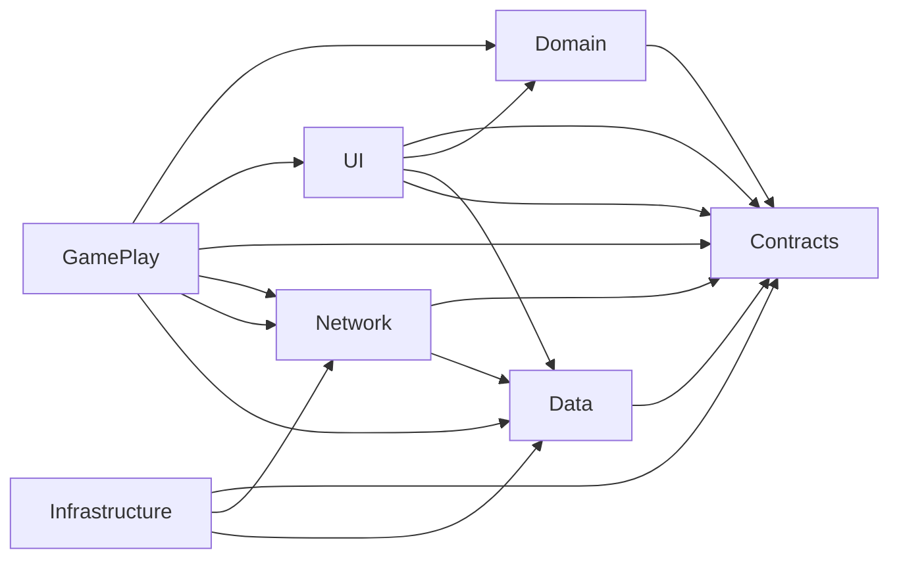
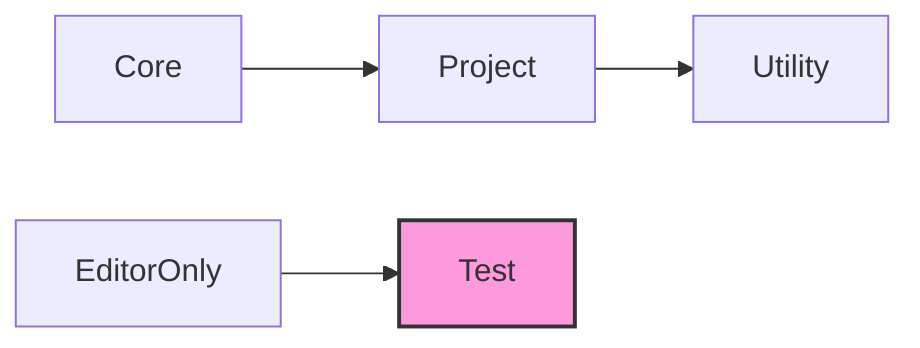

## 목차
1. [설계 범위](#설계-범위)
2. [네임스페이스 설계](#네임스페이스-설계)
3. [DI(Dependency Injection)](#didependency-injection)
4. [Test](#test)
## Link
1. [내부 설계 문서](../_Doc/GamePlayDoc.md)
---
## 설계 범위
프로젝트의 전체적인 설계 범위는 다음과 같습니다.
### Usecase Diagram

---
## 네임스페이스 설계
**분리 목적:** 각 모듈의 책임을 명확히 하고, 의존성을 줄여 유지보수성과 재사용성을 높이기 위해 네임스페이스를 분리했습니다.
### Package Diagram

#### 1. Core
역할: 게임의 전체 적으로 필요한 초기화 관리. 
주요 내용: 게임 초기화 관리 

#### 2. Data
역할: 게임 설정, 초기값, 영구 데이터 정의 및 관리. 
주요 내용: `ScriptableObject` 정의 (스탯, 정보 등), 설정 값, 데이터 테이블 구조, 데이터 저장/로드 인터페이스/기본 핸들러.

#### 3. GamePlay
역할: 실제 인게임 플레이 로직의 대부분. 핵심 게임 메커니즘 구현.  
주요 내용: 타워/적 로직 및 AI, 전투 시스템, 맵 시스템, 플레이어 상태(인게임), 로그라이크 요소, 아이템/스킬 로직. 게임 상태 관리, 씬 로딩, 핵심 게임 루프 관리, 인풋 관리.

#### 4. Network
역할: 네트워크 관련 기능.  
주요 내용: Firebase 연동.

#### 5. UI
역할: 사용자 인터페이스 요소 표시, 상호작용, 로직.  
주요 내용: 화면(View/Screen) 관리, (Button, Popup) 등 제어, UI 애니메이션/효과, UI 이벤트/데이터 바인딩.

#### 6. Utility
역할: 범용 헬퍼 함수, 확장 메소드, 유틸리티 클래스. 
주요 내용: 유틸리티

#### 7. Contracts
역할: `UI`와 `GamePlay`를 이어주는 `Contracts.Interface`. 
주요내용: 주로 구현되는 내용은 `Ineterface.Service`로직으로 `GamePlay`에서 구현된 `Service`내용을 `UI`의 `ViewModel`에서 참조 할수 있도록 함. 

#### 8. Domain
역할: 비지니스 로직들을 구현 
주요내용: `Policy`, `Model`을 구현

#### 9. Infrastructure
역할: 외부에서 저장되는 데이터 `Repository`의 로직을 구현 
주요내용: "Repository" 로직을 구현

#### 10. Test
역할: Unity 에디터 환경에서만 사용되는 스크립트.  
주요 내용: 테스트 코드.

---
## DI(Dependency Injection)
### 1. **사용 목적**

프로젝트 전반에서 의존성을 명확히 관리하고, **테스트, 재사용성**을 높이기 위해 도입했습니다. 
DI 도구로는 [`Zenject`](https://github.com/modesttree/Zenject?tab=readme-ov-file#installation-)를 사용했습니다.

### 2. **관리 내용**

DI로 관리하는 내용은 보통 다음과 같습니다. (모든 `Installer`는 `Core` 단에서 초기화)
* `System, Manager Class`: 핵심 로직을 관리하는 클레스로 단일 객체로 관리.
* `Service` : 어플리케이션 로직. – 예: `PurchaseTowerService`
* `Policy` : 비즈니스 로직. – 예: `GoldPolicy`(킬 보상 계산)
* `Strategy` : 실행 단계에서 교체 가능한 로직 객체. - 예: `PcInputStrategy`, `MobileInputStrategy`
* `Style` : UI에서 디자인에 사용되는 Style을 관리. (Color, Size 등)
* `Repo`, `Model`: Data의 관리, 저장.
* `ViewModel`: UI (MVVM) 관리.
* `Tag` : Scene마다 변화되는 (Main Cavnas 등)을 관리하기 위해 사용. 

### 3. **바인딩 규칙**

- 단일-인스턴스 전역 객체 : `AsSingle()`
- 씬 전용 객체 : AsCached() (씬 컨텍스트가 파괴될 때 함께 소멸)
- 초기화가 필요한 경우 : `IInitializable`, `IDisposable`를 구현하고 BindInterfacesAndSelfTo를 통해 Interface를 Bind
---
## Test
1. **테스트 범위**
   
| 분류 | 내용  | 세부 내용 |
|---|---|---|
| **UI**    | - `ViewModel` ↔ UI 데이터 바인딩 - UI 이벤트 → `ViewModel` 호출        | `NSubstitute`로 Service/Repository 호출 검증 |
| **Network** | Firebase 실서버                                           | 송수신 검증 |
| **Service** | 도메인 로직 검증, 외부 의존성 호출 횟수 & 파라미터 확인                 | `NSubstitute` Mock 테스트  |
| **Unit**  | C# 로직 (예: `MapGenerator`) 검증                               | 데이터 정확도 검증 |

2. **Tool**
* Unity Test Runner  
* [NSubstitute (Mock)](https://github.com/Thundernerd/Unity3D-NSubstitute)

